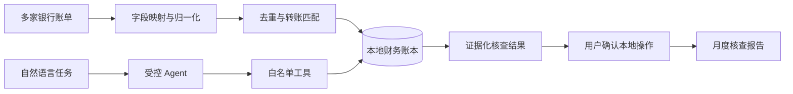
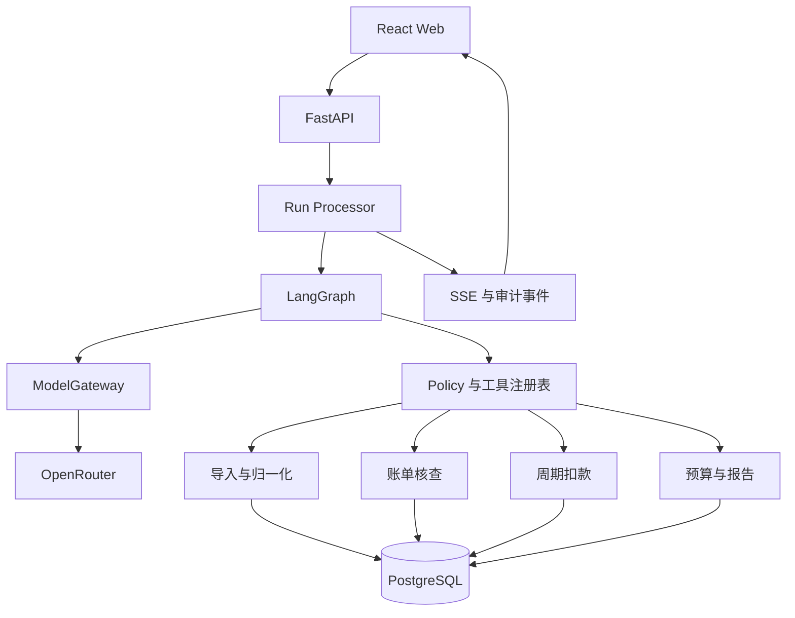

# BankPilot Agent

> 面向隐私敏感用户的可审计、可复算、多账户财务分析 Agent。

BankPilot 将用户主动导出的银行账单归一化为本地财务数据，通过受控 Agent 完成跨账户查询、异常核查、周期扣款识别、预算偏差分析和月度报告。系统不连接银行，不执行资金、卡片或商户合同操作。

## 产品价值

| 用户问题 | BankPilot 输出 |
| --- | --- |
| 多家银行账单格式不同 | 统一字段、账户、币种和交易标识，提供导入报告 |
| 重复交易或账户间转账影响统计 | 文件哈希、行级指纹、相似交易和转账匹配结果 |
| 财务结论无法验证 | 金额由 Decimal 计算，结论关联规则、阈值和交易 ID |
| 查询过程依赖固定筛选器 | Agent 将自然语言转换为结构化、多步骤查询计划 |
| 异常、续费和预算需要定期检查 | 主动生成待核查事项，用户确认后设置本地提醒或修正 |
| 财务数据不适合交给外部模型 | 原始账单保留在本地，模型只接收任务和必要聚合信息 |

## Agent 能力

Agent 负责理解目标、组织工具调用、解释结果和管理确认流程；权限、金额、去重、分类和状态变更由确定性程序控制。

### 只读工具

| 工具 | 能力 |
| --- | --- |
| `query_transactions` | 按日期、账户、商户、金额和分类查询交易 |
| `get_finance_summary` | 获取收入、支出、净额、分类和趋势 |
| `explain_anomaly` | 返回异常规则、阈值和关联交易 |
| `list_recurring_charges` | 返回周期、可信度和预计扣款时间 |
| `get_budget_status` | 返回预算使用率、剩余额度和偏差预测 |
| `get_import_report` | 返回导入批次、失败行和重复项 |
| `get_report_summary` | 生成可复算的月度核查报告摘要 |
| `query_audit_log` | 查询模型计划、工具调用和本地操作记录 |

### 需确认的本地工具

| 工具 | 状态变化 |
| --- | --- |
| `correct_category` | 保存分类修正，不覆盖原始交易 |
| `update_budget` | 修改本地预算 |
| `set_local_reminder` | 设置或关闭本地提醒 |
| `generate_report` | 生成本地脱敏报告 |

本地写操作必须经过用户确认，并具备幂等键、审计记录和明确结果。Agent 不具备真实转账、卡片状态变更、代扣关闭和理财交易工具。

## 可信执行

| 常见实现 | BankPilot |
| --- | --- |
| 模型直接读取完整账单 | 原始账单本地保存，工具只返回必要字段或聚合结果 |
| 模型直接计算金额 | Decimal 和领域规则计算，模型仅解释结果 |
| 自由生成工具参数 | JSON Schema、Pydantic 和工具白名单共同校验 |
| 只返回分析文本 | 结果绑定交易、规则、阈值和运行记录 |
| 自动修改数据 | 用户确认后执行可撤销或可覆盖的本地状态变更 |
| 请求失败后状态不明 | Run 状态机、SSE、幂等和中断恢复 |

## 产品功能

| 模块 | 最终能力 |
| --- | --- |
| 账户与身份 | 邮箱注册、密码哈希、HttpOnly Session 和用户数据隔离 |
| 账单导入 | CSV/Excel、字段映射、校验、归一化、去重、转账匹配和导入报告 |
| Agent 工作台 | 多步骤计划、工具执行状态、跨账户查询、证据引用和确认操作 |
| 账单核查 | 收支与分类统计、异常规则、分类修正和交易追溯 |
| 周期扣款 | 周期识别、预计扣款日、金额变化、可信度和本地提醒 |
| 预算监控 | 分类预算、执行进度、偏差预测和阈值提醒 |
| 月度报告 | 待核查事项、收支变化、周期扣款、预算偏差和脱敏导出 |
| 数据与审计 | 数据边界、模型元数据、工具调用、用户确认和本地数据导出 |

余额仅在导入文件包含可靠余额字段时展示；仅有交易流水时不推导实时余额。周期扣款日期和预算预测属于规则估计，必须同时展示依据和可信度。

## 技术架构

模型供应商、账单解析器、身份、存储和通知渠道通过端口隔离。首选 OpenRouter，但领域逻辑不依赖特定模型。

## 验收标准

| 指标 | 要求 |
| --- | ---: |
| 金额可复算率 | 100% |
| 分析结论证据绑定率 | 100% |
| 重复导入交易 | 0 |
| 原始账单发送给模型 | 0 |
| 未授权数据访问 | 0 |
| 未确认本地写操作 | 0 |
| 关键任务完成率 | ≥95% |
| API、Web、迁移和远程健康检查 | 全部通过 |

## 范围外能力

- 真实转账、收款、定时划款和资金结算
- 锁卡、解锁、挂失、调额和银行卡申请
- 关闭银行代扣或解除商户合同
- 理财推荐、申购、赎回和收益承诺
- 保存网银凭证、自动登录银行或调用非公开银行接口
- 根据交易流水推导实时账户余额
- 面向公众提供金融服务

## 文档

| 文档 | 内容 |
| --- | --- |
| [最终产品界面](docs/final-product.html) | 最终信息架构、Agent 工作台和交互闭环 |
| [当前交付状态](docs/CURRENT_STATE.md) | 已交付能力、验证证据和差距 |
| [产品路线图](docs/ROADMAP.md) | 后续用户闭环、Agent 工具和发布门禁 |
| [运行手册](docs/RUNBOOK.md) | 当前系统的开发、配置、API 和验证方式 |
| [远程部署](deploy/README.md) | GitHub Actions、Tailscale、Compose、Cloudflare Tunnel 和数据库访问 |

## License

尚未确定开源许可。在明确 License 前，请勿再分发项目代码或文档。
