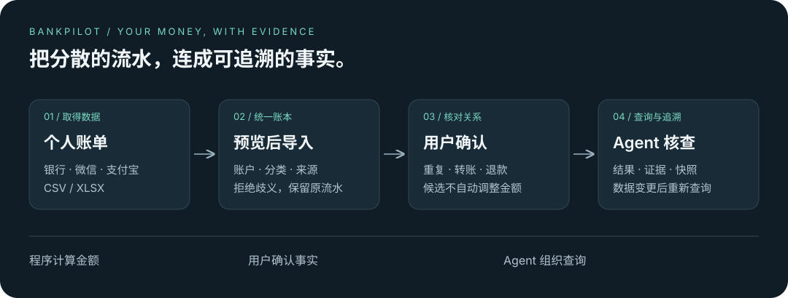

# BankPilot Agent

> 看清每一笔钱的来处与去向。

BankPilot 是面向个人的账单核查 Agent。导入银行、微信或支付宝账单后，将分散的流水整理成统一账本，核对重复记录、本人转账和退款，再用自然语言查看有交易证据的结果。

## 从流水到可核对的结果

选择账单文件，先预览，再确认账户并导入。在账本中筛选交易、修正分类，确认重复、转账或退款关系。Agent 同时展示原始流水和确认关系后的调整结果，保留生成时的证据。修改账本后重新查询，得到新的快照。

候选关系不会自动改变统计。跨月退款按到账日处理，各币种独立计算；数据不足时明确提示范围，避免把“没有导入”解释成“没有消费”。

顶部“问助手”支持月度收支、预算和固定支出问答、多轮追问，以及确认后设置或修改预算。单月、分类、币种消费可查看逐笔构成和退款原消费，打开账本修正后返回助手；账本或计算规则变化时需重新查询。模型按问题选择查询工具；预算修改展示前后差异，确认后才生效。原账单核查仍保留日期范围快照；账户与商户筛选在账本页面完成。页面和期间可通过浏览器地址恢复。

## 可靠性来自清晰的分工

React 与 TypeScript 构建界面，FastAPI 承载业务，PostgreSQL 保存账本与运行快照。Agent 通过 LangGraph 编排，由 OpenRouter 规划查询；金额计算、交易关系、用户隔离和写入校验由程序执行。模型网关和来源解析器可以独立扩展。

密钥保存在服务端环境中。认证使用 Argon2 与 HttpOnly Cookie，数据库结构由 Alembic 管理。详细设计见[系统架构](docs/ARCHITECTURE.md)。

## 使用范围

支持 CSV 和未加密单表 XLSX，单文件不超过 10 MB、5,000 条交易。微信、支付宝适配器按公开字段结构实现，真实脱敏导出文件认证仍待完成；不保证所有历史格式兼容。

系统只分析已导入的账单，不登录网银、不读取实时余额、不执行资金操作。月度报告支持可读摘要、流水表格与完整证据导出及打印入口；固定支出支持从流水建立、按生效月份变更、核对扣款及可撤回的未发生确认；预算支持上月参考、复制额度、覆盖范围与明细下钻。总览集中展示需要关注的预算和固定支出。

## 开始使用

按[运行手册](docs/RUNBOOK.md)配置环境并启动，浏览器打开 [localhost:5173](http://127.0.0.1:5173)。

[交付与验证](docs/CURRENT_STATE.md) · [架构设计](docs/ARCHITECTURE.md)

[交互产品原型](docs/final-product.html)展示当前深色页面、分类预算、固定支出核对与消费证据助手。使用合成数据，操作仅保存在页面内存，不连接后端或模型；刷新重置。完整能力与验收范围以交付与验证文档为准。

尚未确定开源许可。
