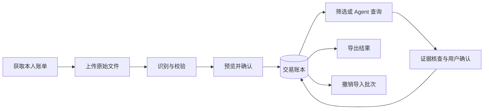
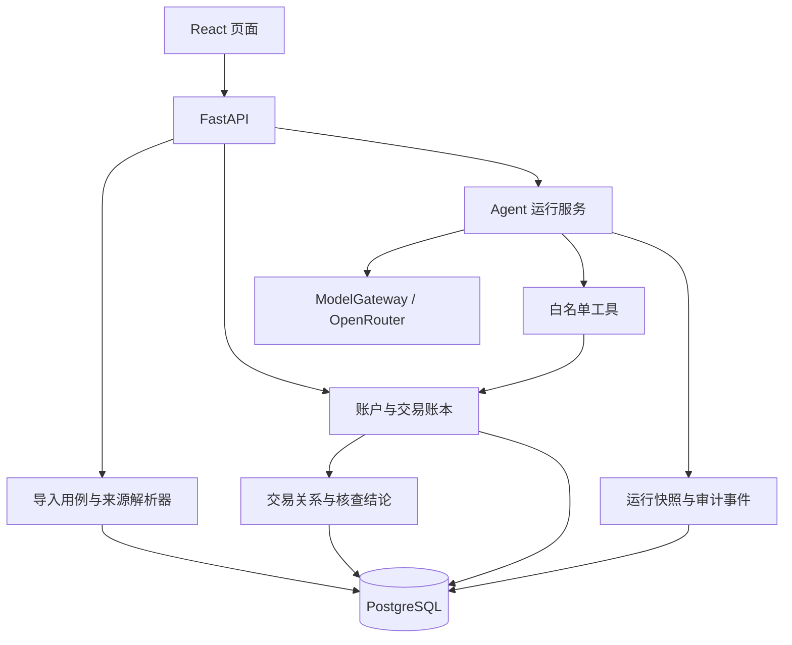

# BankPilot Agent

> 将多来源账单还原为可验证记录的个人财务核查 Agent。

用户上传自主获取的账单，核对来源、识别差异、确认必要问题，并获得可复算结果。分析始终说明账户、币种、期间和证据缺口；不把流水直接等同于真实收入或净消费。实际支持范围与验收证据见 [交付状态](docs/CURRENT_STATE.md)。

## 用户流程

## 数据来源

系统仅接入普通个人用户能够自行取得的账单。每个机构格式均需经过真实脱敏样本验证，支持某种文件扩展名不代表支持该机构的全部账单。

| 来源 | 接入条件 |
| --- | --- |
| 个人银行或支付平台导出文件 | 普通个人账户可下载，无商户资格、开发者权限或特殊审批要求 |
| CSV、Excel、TXT、PDF、压缩包 | 来源适配器通过实际样本验证后开放；不要求用户转换或重排文件 |
| 账户、分类与预算意图 | 文件中可确认的信息或用户明确输入 |
| 异常与周期推断 | 仅由已导入交易生成，显示规则和依据 |

来源适配必须核验导出路径、账户标识、日期精度、收支方向、币种、交易状态与退款语义。能够取得文件、能够解析文件、能够正确统计是三项独立条件。

文件验收采用固定输入、预期金额和完整导入链路，参见 [CSV 验收文件](api/tests/fixtures/statements/README.md)。虚构测试数据不构成任何机构的格式兼容证明。

不接入商户账单 API、网银自动登录、非公开接口或银行内部数据。不提供实时余额、银行卡有效或锁定状态，也不执行资金与银行合同操作。

## 账本与核查

| 能力 | 行为与边界 |
| --- | --- |
| 导入 | 原文件不长期保存；写入前预览，明确异常，确认后保存标准交易和批次报告 |
| 账户 | 从导入归属建立，名称和币种可追溯；不伪造卡片信息 |
| 交易账本 | 不依赖模型即可按期间读取交易，查看账户、商户、金额和分类 |
| 分类修正 | 独立保存用户修正，保留原始交易字段 |
| 财务口径 | 分别表达资金流入流出与经核对的净消费；未确认关联不得自动抵销 |
| 核查处理 | 展示规则和来源证据，保存正常或待核实判断、备注；允许恢复待处理 |
| 去重 | 优先使用来源交易标识；缺少可靠标识时不能保证跨来源自动合并 |
| 撤销批次 | 移除该批次实际写入的交易；保留批次报告与历史分析快照 |
| 导出 | 导出筛选结果 CSV，保留金额、币种与来源指针；文本防公式执行，不作为原账单或无损备份 |
| 历史 | 查看运行结果与事件；修正账本后重新查询，不覆盖已有结果快照 |
| Agent | 围绕核查任务选择受控步骤、校验数据条件与证据，必要时请求用户确认 |

导入重叠账单、银行与支付平台同时记录同一笔消费时，必须区分重复记录、真实重复交易、退款和账户间转账。没有足够证据的关联不得自动从统计中删除。

历史分析是生成时的数据快照，修正或撤销后应重新查询。只有已导入交易的收支可统计，空数据不代表无消费，最后一笔交易日期也不等于账单完整覆盖日期。

核查结论不改变原始金额，不代表银行已退款或处理争议。仅有日期的记录不能支持分钟级判断。来源适配器必须明确金额格式，不能猜测分隔符语义；无法确认的关联保留待核实。

## Agent 边界

模型负责理解任务和选择受控工具；权限、金额、状态变更、去重与分类覆盖由程序执行。

- 模型网关默认使用 OpenRouter，领域规则不依赖模型供应商。
- 模型不可用时，导入、账本、分类修正与数据导出仍可操作。
- 金额使用 Decimal，按币种分别计算。
- 用户隔离在服务端查询中执行，模型不能指定其他用户身份。
- Agent 发起的写操作必须绑定目标、参数与用户确认。
- 周期扣款仅表示历史交易模式，不能证明仍存在有效订阅合同。
- 预算由用户设定；报告必须注明数据期间与缺失范围。

## 架构

| 边界 | 职责 |
| --- | --- |
| web/src/app | 页面与工作区组织 |
| web/src/features | 导入、账本、总览和 Agent 界面 |
| api/src/bankpilot/api | 认证、接口契约与请求校验 |
| api/src/bankpilot/services | 导入事务和运行编排 |
| api/src/bankpilot/domain | 解析契约、金额、分类与核查规则 |
| api/src/bankpilot/adapters | 模型与数据源适配 |
| api/src/bankpilot/db | 用户归属、数据关系与持久化 |

本地 React 与远程页面通过 Tailscale 使用同一远程 API 和 PostgreSQL。业务操作影响同一份数据；自动测试使用隔离数据库。API Key、数据库密码与 Session Secret 仅由服务端环境注入。

## 验收要求

| 检查 | 通过条件 |
| --- | --- |
| 来源可获得 | 普通个人账户按指引取得原始文件，并完成脱敏样本验证 |
| 易用性 | 支持来源不要求转格式、改表头或整理金额符号 |
| 正确性 | 日期、交易数量、金额、币种与原账单核对一致 |
| 纠错 | 失败可定位；分类可修正；错误批次可撤销 |
| 可追溯 | 交易关联账户和批次；报告说明数据范围 |
| 独立可用 | 模型不可用仍能管理账本 |
| 用户隔离 | 越权读取与修改均被拒绝 |

## 文档

- [交付状态](docs/CURRENT_STATE.md)：实际支持范围与验证证据
- [运行手册](docs/RUNBOOK.md)：环境配置、运行与检查
- [产品路线图](docs/ROADMAP.md)：实现计划
- [产品界面](docs/final-product.html)：界面设计参考

## License

尚未确定开源许可。
