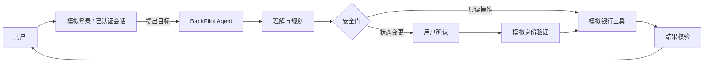
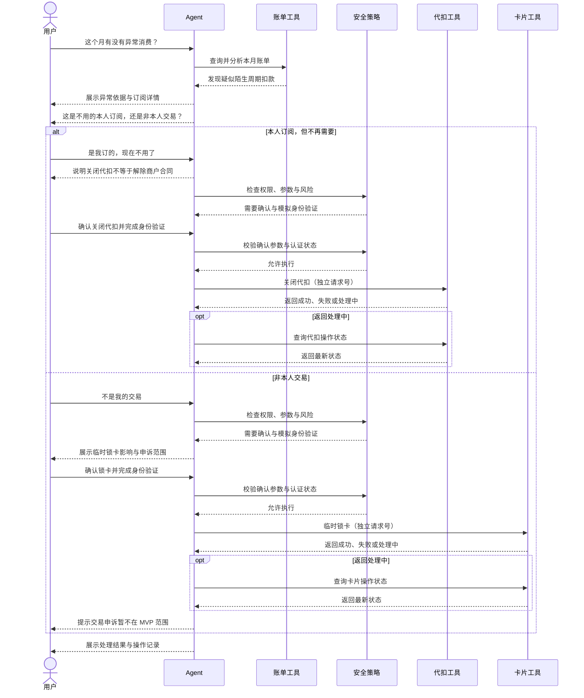
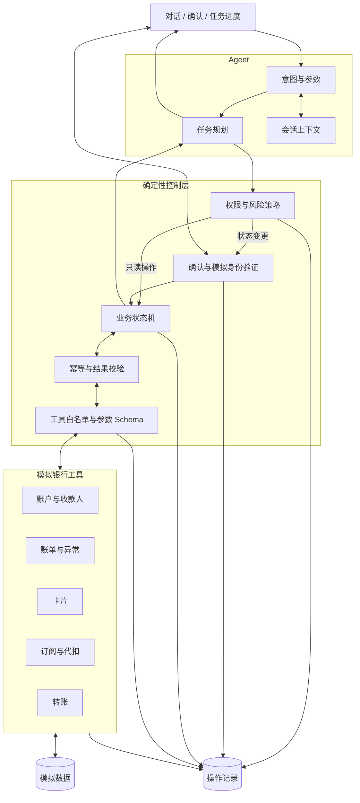

# BankPilot Agent

> 用自然语言完成银行任务：Agent 负责理解、规划与协作，确定性程序负责校验与执行。

**定位：** Agent 能力验证与场景演示　·　**数据：** 全部模拟　·　**当前阶段：** 需求与架构设计

## 一眼看懂

| Agent 做什么 | 确定性程序做什么 | 系统不做什么 |
| --- | --- | --- |
| 理解意图、补全信息、拆解任务、选择工具 | 金额计算、余额与限额校验、状态变更、幂等控制 | 连接真实银行、处理真实资金、替代完整网银 |

## MVP 场景地图

| 场景 | 用户目标 | 核心 Agent 能力 | 操作风险 |
| --- | --- | --- | --- |
| 智能转账 | “给妈妈转 2,000 元” | 收款人消歧、参数补全、转账规划 | 高 |
| 账单分析 | “这个月钱花哪了？” | 分类统计、趋势解释、异常识别 | 低 |
| 卡片管理 | “卡丢了，先锁住” | 卡片定位、影响说明、状态操作 | 高 |
| 订阅管理 | “找出没用的自动扣费” | 周期识别、跨场景联动、关闭代扣 | 中 |

理财推荐与模拟申购放入后续扩展，不进入首个可运行版本。

## 核心演示：识别周期扣款并正确分流

这条链路根据用户判断进入订阅管理或卡片管理。智能转账作为第二条独立演示链路。

## 概念架构

## 工具边界

| 领域 | 查询工具 | 变更工具 | 执行要求 |
| --- | --- | --- | --- |
| 账户 | `get_accounts`、`search_payees` | — | 已认证会话内查询 |
| 转账 | `check_transfer`、`get_transfer_status` | `create_transfer` | 变更需确认与模拟身份验证 |
| 账单 | `query_transactions`、`analyze_bill`、`detect_anomalies` | — | 已认证会话内查询 |
| 订阅 | `detect_subscriptions`、`get_debit_status` | `cancel_debit` | 变更需确认与模拟身份验证 |
| 卡片 | `list_cards`、`get_card_operation_status` | `lock_card`、`unlock_card`、`report_card_lost` | 变更需确认与模拟身份验证；正式挂失必须单独确认 |

> 表中是领域能力约定，不代表接口已经实现。

## MVP 验收矩阵

| 验收项 | 通过标准 |
| --- | --- |
| 场景闭环 | 至少 3 个场景可通过自然语言端到端完成 |
| 主动澄清 | 参数缺失、同名收款人或多张卡时不自行猜测 |
| 变更确认 | 未确认时任何状态变更工具都不可调用 |
| 身份验证 | 转账、代扣和卡片状态变更必须通过模拟身份验证 |
| 参数绑定 | 金额、对象或账户变化后必须重新确认 |
| 工具安全 | 仅允许调用白名单工具；所有参数通过结构化 Schema 和业务规则校验后才能执行 |
| 指令隔离 | 账单、商户名称和工具返回内容只作为数据处理，不得作为 Agent 指令执行 |
| 订阅边界 | 明确区分关闭银行代扣与解除商户订阅合同 |
| 异常扣款分流 | 本人但不再需要的订阅进入关闭代扣；非本人交易进入锁卡并提示申诉边界 |
| 智能转账 | 完成收款人消歧、余额与限额预检、参数确认、模拟身份验证、幂等执行和超时查单 |
| 正式挂失 | 明确提示成功后不可撤销，必须单独确认，不与临时锁卡共用确认记录 |
| 幂等执行 | 重复请求不产生重复转账或重复状态变更 |
| 组合操作 | 每项变更使用独立请求号，并分项展示执行状态 |
| 异常恢复 | 超时后只查询状态；最终进入成功、失败、继续等待或人工处理 |
| 可追溯 | 可查看结构化任务步骤、确认记录、工具调用和最终状态 |
| 数据边界 | 账户、卡片、账单和交易全部使用模拟数据 |
| 固定评测集 | 不少于 40 个用例，每个场景至少 10 个，覆盖正常、澄清、修改或拒绝、工具失败或超时、越权或提示词注入 |

## 开发顺序

| 1. 最小闭环 | 2. 高风险任务 | 3. 跨场景 | 4. 质量验证 |
| --- | --- | --- | --- |
| 模拟数据与工具 账单 → 锁卡 | 转账状态机 确认与幂等 | 订阅联动 进度与审计 | 异常测试集 Agent 评测 |

## 当前状态

| 已完成 | 待完成 |
| --- | --- |
| 产品范围、核心流程、概念架构、安全边界 | 技术栈选型、工程骨架、模拟数据、Agent 与工具实现、测试 |

## License

尚未确定开源许可。在明确 License 前，请勿再分发项目代码或文档。
