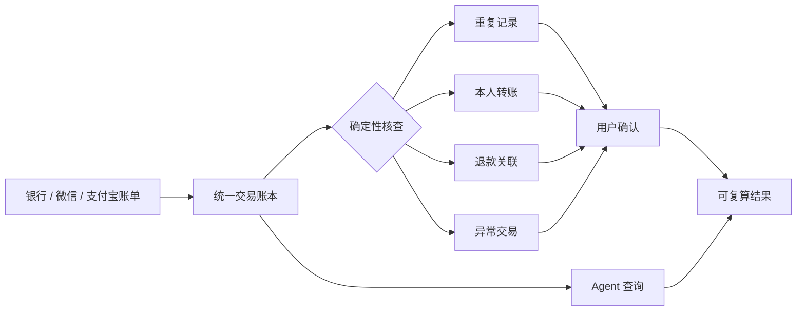
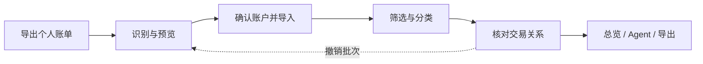
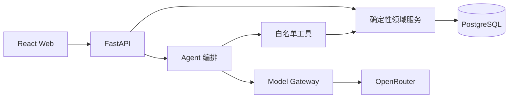
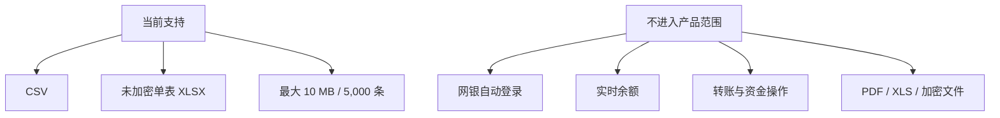

# BankPilot Agent

> 将分散的个人账单整理成可核对、可修正、可追溯的财务账本。

BankPilot 面向需要统一管理银行、微信和支付宝流水的个人用户。系统不登录网银，也不执行资金操作；用户导入自己取得的账单，系统负责统一结构、发现交易关系，并给出有证据的核查结果。

## 它解决什么问题

传统记账工具依赖用户逐笔录入，通用 AI 又难以保证金额和权限正确。BankPilot 将两者分开：程序负责账务事实，Agent 负责理解问题和组织查询。任何关系候选都必须由用户确认，原始流水始终保留。

## 使用路径

当前已经形成从注册、账单导入、账本核对到结果导出的主流程。周期扣款与预算监控保留产品入口，但不会生成模拟结果。准确交付范围见[当前交付状态](docs/CURRENT_STATE.md)。

## 系统如何工作

交易账本是唯一事实来源。文件解析、金额计算、用户隔离、去重和状态变更均由服务端完成；模型只能选择受控工具。来源解析器和模型网关采用适配器边界，可以独立扩展或替换。

技术主体为 React、TypeScript、Vite、FastAPI、PostgreSQL、SQLAlchemy 与 Alembic。认证使用 Argon2 和 HttpOnly Cookie，模型密钥只通过服务端环境注入。更完整的模块关系与数据约束见[系统架构](docs/ARCHITECTURE.md)。

## 能力边界

微信和支付宝已按公开字段结构验收，仍需真实脱敏导出文件完成来源认证。所有结果只反映已导入数据；模型请求不得包含密码、密钥或账单原文。

## 开始使用

本地启动后访问 [http://127.0.0.1:5173](http://127.0.0.1:5173)。配置、启动、迁移与验收命令见[运行手册](docs/RUNBOOK.md)。

[当前交付状态](docs/CURRENT_STATE.md) · [产品路线图](docs/ROADMAP.md) · [系统架构](docs/ARCHITECTURE.md) · [运行手册](docs/RUNBOOK.md) · [产品界面](docs/final-product.html)

## License

尚未确定开源许可。
