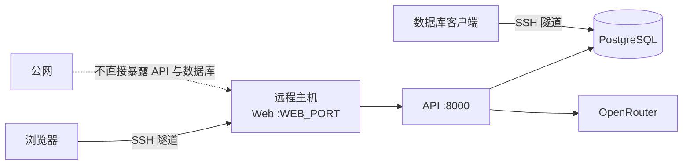

# 远程部署



## 安全边界

| 项目 | 约束 |
| --- | --- |
| Web | 默认绑定远程主机 `127.0.0.1`，通过 SSH 隧道访问 |
| API | 只在 Compose 内网开放，由 Web 反向代理 |
| PostgreSQL | 默认绑定 `127.0.0.1`，只接受主机本地或 SSH 隧道连接 |
| Session Cookie | SSH 隧道 HTTP 使用 `HttpOnly`、`SameSite=Lax`；启用 HTTPS 后将 `BANKPILOT_SESSION_COOKIE_SECURE` 改为 `true` |
| OpenRouter Key | 只写入远程 `/opt/bankpilot-agent/deploy/.env`，权限 `600` |
| 模型 | 使用明确 `MODEL_ID`，禁止 `openrouter/auto` |

## 远程主机执行

```bash
cd /opt/bankpilot-agent/deploy
cp .env.example .env
chmod 600 .env
docker compose --env-file .env up -d --build
docker compose --env-file .env ps
```

K3s 部署使用同一份受保护的 `.env`：

```bash
cd /opt/bankpilot-agent
./deploy/k8s/deploy.sh
```

| 部署方式 | Web 入口 | API | PostgreSQL |
| --- | --- | --- | --- |
| Docker Compose | 回环端口 + SSH 隧道 | Compose 内网 | 回环端口 + SSH 隧道 |
| K3s | Traefik Ingress | ClusterIP | 无头 ClusterIP |

K3s 中需要外部查库时，先在远程主机将 PostgreSQL 临时转发到回环端口，再建立 SSH 隧道；不将数据库 Service 改为 NodePort。

```bash
sudo k3s kubectl -n bankpilot port-forward \
  --address 127.0.0.1 service/postgres 55433:5432
```

首次启动后创建本地银行账户：

```bash
docker compose --env-file .env exec api uv run bankpilot seed
```

在应用电脑建立 SSH 隧道：

```bash
ssh -N \
  -L 8380:127.0.0.1:8380 \
  -L 55433:127.0.0.1:55433 \
  <user>@<remote-host>
```

浏览器访问 `http://localhost:8380`。密钥和密码不得提交到 Git。

## 外部数据库客户端

连接参数：

| 字段 | 值 |
| --- | --- |
| Host | `127.0.0.1` |
| Port | `POSTGRES_HOST_PORT` |
| Database | `POSTGRES_DB` |
| Username | `bankpilot_client` |
| SSL | 当前关闭，运输链路由 SSH 隧道加密 |

客户端账号只授予业务表和序列的数据读写权限，不授予建表、迁移或删除 Schema 的权限。
