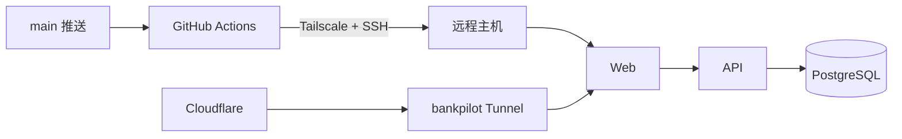
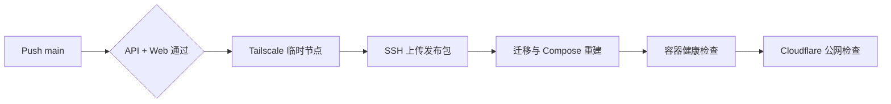

# 生产部署

BankPilot 由 GitHub Actions 更新远程 Docker Compose 源站，Cloudflare Tunnel 提供 HTTPS 公网入口。API 与 PostgreSQL 不直接暴露到公网。



## 自动发布

`.github/workflows/ci.yml` 在 Pull Request 中只执行质量门禁；仅 `main` 推送且 API、Web 全部通过后执行生产发布。



GitHub `production` Environment 需要以下配置：

| 类型 | 名称 | 内容 |
| --- | --- | --- |
| Secret | `TS_OAUTH_CLIENT_ID` | Tailscale OAuth Client ID |
| Secret | `TS_OAUTH_SECRET` | 仅允许 `tag:ci` 的 OAuth Client Secret |
| Secret | `DEPLOY_SSH_KEY` | 仅用于发布用户的 SSH 私钥 |
| Secret | `DEPLOY_KNOWN_HOSTS` | 已核验的远程 SSH host key |
| Variable | `DEPLOY_HOST` | 远程主机 Tailscale IP 或 MagicDNS 名称 |
| Variable | `DEPLOY_USER` | 发布用户 |
| Variable | `DEPLOY_PATH` | 绝对路径，例如 `/opt/bankpilot-agent` |
| Variable | `PUBLIC_URL` | Cloudflare HTTPS 入口，例如 `https://master-orange.com` |

Tailscale ACL 只应允许 `tag:ci` 访问发布主机的 SSH 端口。远程用户需允许 CI 非交互执行 `rsync` 和 Docker Compose。

`deploy/remote-deploy.sh` 会删除远程旧源码并同步 `main` 最新内容，但始终保留权限为 `600` 的 `deploy/.env`。发布包与临时目录在执行结束后删除，不保留历史版本副本。

## Cloudflare Tunnel

Cloudflare 仅作为公网边缘和反向隧道，不承载 FastAPI 或 PostgreSQL。

| 项目 | 配置 |
| --- | --- |
| Tunnel | 独立的 `bankpilot` Tunnel |
| Published application | 产品根域名 |
| Service URL | `http://<tailscale-ip>:8380` |
| DNS | 根域 CNAME 指向 `<tunnel-id>.cfargotunnel.com` 并启用代理 |
| 其他子域 | 保留独立服务的 Tunnel 记录 |

Tunnel Token 只保存在远程 `cloudflared` 运行环境，不进入代码、GitHub 制品或日志。Tunnel 为一次性基础设施，日常发布只更新远程源站。

## 远程配置

`deploy/.env` 只在远程主机维护，不由 CI 上传：

```dotenv
WEB_BIND_IP=<tailscale-ip>
WEB_PORT=8380
PUBLIC_WEB_ORIGIN=https://master-orange.com
BANKPILOT_SESSION_COOKIE_SECURE=true
```

`POSTGRES_PASSWORD`、`BANKPILOT_SESSION_SECRET` 和 `OPENROUTER_API_KEY` 也只存在该文件。生产服务中 Web 仅反向代理 API，PostgreSQL 只绑定回环地址。

## 数据库访问

数据库客户端通过 SSH 隧道访问，不开放公网端口：

```bash
ssh -N -L 55433:127.0.0.1:55433 <user>@<tailscale-host>
```

| 字段 | 值 |
| --- | --- |
| Host | `127.0.0.1` |
| Port | `55433` |
| Database | `bankpilot` |
| Username | 只具有必要业务权限的客户端账号 |
