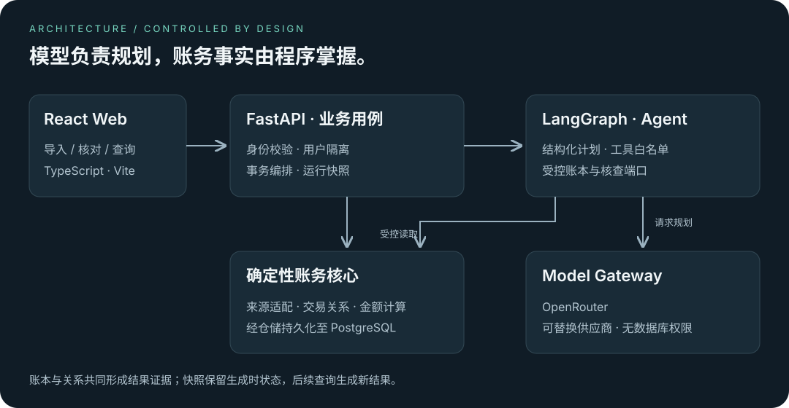

# 系统架构

BankPilot 将账本事实、关系判断和分析结果分开保存。金额与权限由确定性代码控制，模型负责选择受限的查询步骤。



## 模块职责

React 负责导入、账本、关系核对与 Agent 界面。FastAPI 验证会话和请求，应用服务组织事务；领域层实现来源解析、分类、交易关系与统计。PostgreSQL 保存用户数据和运行结果，Model Gateway 隔离 OpenRouter 接入。

来源适配器变化不应改变标准交易规则，模型供应商变化不应改变权限和金额口径。工作流通过端口访问领域能力，不直接编排数据库查询。

应用入口统一注入模型与核查端口，运行处理器不创建具体核查适配器。页面及查询期间保存在 URL 中，支持刷新恢复和浏览器前进后退；文件与表单内容只保存在内存。

## 从文件到证据

预览和导入复用解析契约。用户确认账户后，服务端重新校验并原子写入批次与交易。原文件在内存中处理，持久化交易保留批次和行号；分类修正和关系确认不覆盖原始金额。

Agent 在模型规划完成后读取用户账本。独立的核查端口在同一个数据库快照中装配期间交易、关系和证据，避免并发编辑使统计与证据来自不同状态。工作流使用该结果生成原始分析与调整分析，并将结果持久化。

重复打开运行记录读取已保存结果。该快照保留当时证据，不是当前账本的实时视图，也不等同于完整账本版本历史。

## 金额口径

重复关系由用户指定保留流水，只排除副本；本人转账排除已确认的双边收支；退款在到账日冲减流出。跨期的另一端作为证据保留，不移入本期统计。退款可能使本期调整流出为负。

候选限制为同币种：重复记录跨批次、等额且相差不超过一天；本人转账跨账户、等额反向且相差不超过三天；退款发生于支出后九十天内，累计不得超过原支出。服务端对人工配对同样复查事实、归属与并发版本。

原始统计与调整统计分别展示。分类汇总和异常规则基于原始交易，不应被标记为调整后的分类结果。

## Agent 边界

模型仅接收用户任务及规划上下文，交易证据由本地服务装配。模型不能选择用户身份、修改交易、确认关系或绕过工具白名单；模型不可用不影响独立的导入与账本功能。

查询契约只接受日期范围，规划器对无法表达的附加筛选返回不支持。供应商响应的外层结构、计划和元数据均经校验，畸形响应统一返回模型输出无效。Web 按运行 ID 与修正请求序号接收异步结果，旧任务响应不能覆盖新运行。

快照包含原始交易、调整统计、规则与关系版本、双方证据和生成时间。覆盖信息只记录查询区间与读取数量，完整性保持未认证。候选截断单独标识，不能将部分数据包装为完整结果。

候选扩展窗口超过 10,000 笔时停止候选发现，另行完整读取期间流水和已保存关系的双边证据，继续提供确定性统计并标记候选未穷尽。只有期间流水自身超过 10,000 笔才要求缩小期间；任何截断集合均不得用于金额汇总。

## 代码组织

```text
web/src/app          页面注册、导航、跨页面状态
web/src/features     独立产品功能界面

api/.../api          会话校验、请求与响应契约
api/.../services     事务与用例编排
api/.../agent        模型规划、工具执行、结果组织
api/.../domain       解析、分类、金额与关系规则
api/.../adapters     领域端口与外部服务实现
api/.../db           持久化与用户数据归属
```

会话提供用户身份，业务查询强制用户隔离；密钥通过环境配置；数据库结构由 Alembic 管理；CI 使用独立数据库。静态产品 HTML 与未实现模块保留，但不参与业务计算。

[运行手册](RUNBOOK.md) · [当前能力](CURRENT_STATE.md) · [产品路线图](ROADMAP.md)
