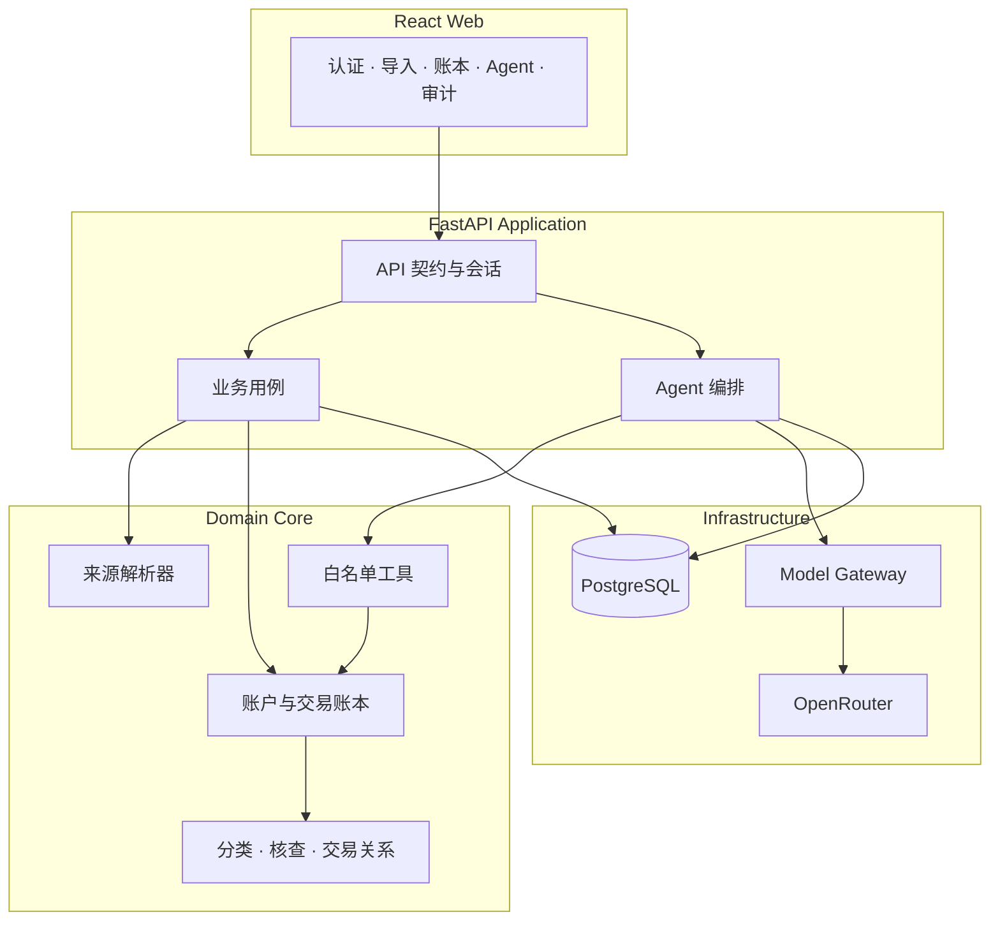
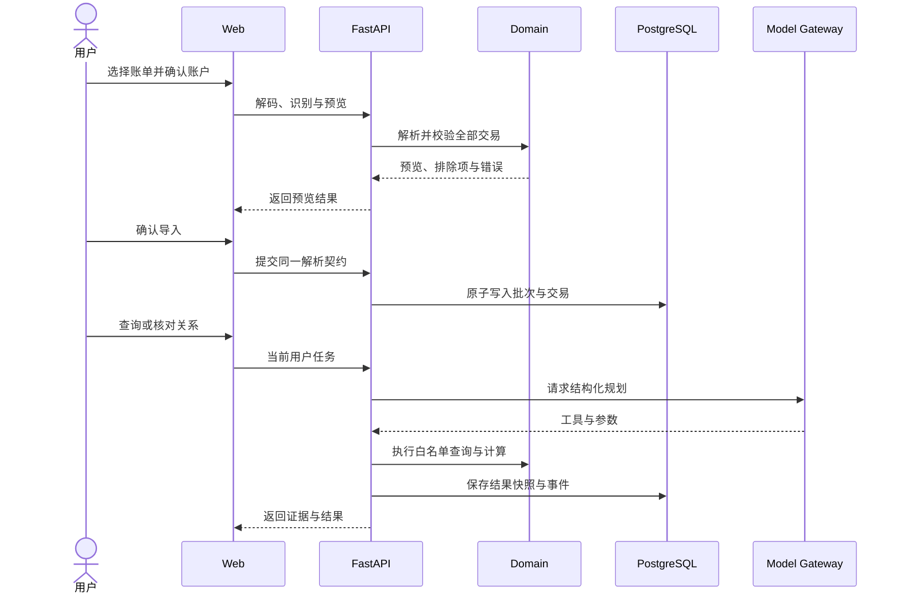
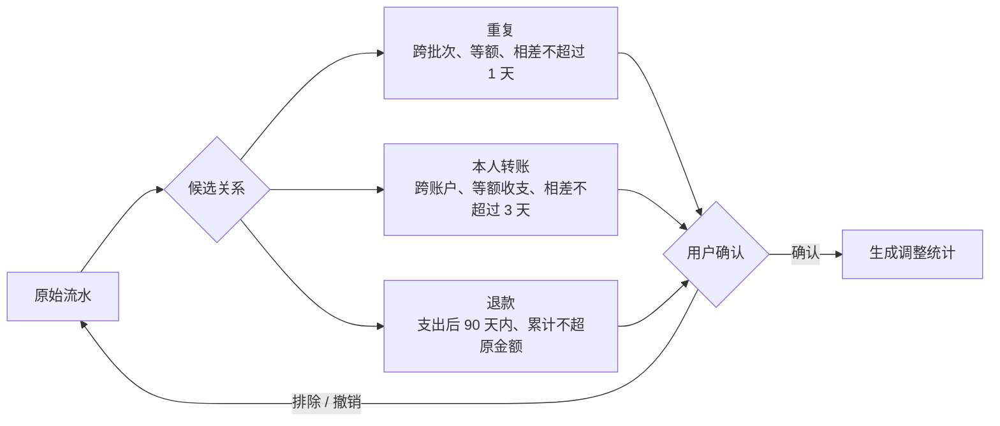
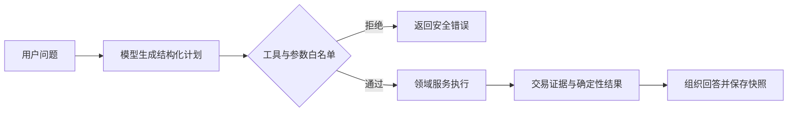

# 系统架构

系统以三个约束为核心：账务结果可复算、模型行为受控制、外部来源可替换。交易账本是唯一事实来源，Agent 不能绕过领域服务接触数据库。

## 总体结构



文件格式变化被限制在来源适配器，模型供应商变化被限制在 Model Gateway。金额、权限、事务和用户归属始终位于确定性核心中。分析结果只能形成独立记录或快照，不能覆盖原始交易。

## 数据流



预览和导入复用同一解析器。原文件只在内存中解码，交易记录保留来源批次和行号。分类修正不改变原始字段，交易关系不删除流水。

## 交易关系模型



候选只缩小人工核对范围。无论自动建议还是手动配对，服务端都会重新检查事实约束、用户归属和并发版本。

## Agent 控制面



模型可以理解日期、识别核查意图并选择工具，但不能指定用户身份、访问数据库、修改金额或覆盖权限。当前 Agent 只开放账本查询；模型不可用时，导入、账本、分类和导出仍可运行。

## 代码边界

```text
web/src/app          页面注册、导航、跨页面状态
web/src/features     独立产品功能界面

api/.../api          认证、请求校验、响应契约
api/.../services     用例事务、跨领域编排
api/.../domain       解析、金额、分类、关系、核查规则
api/.../adapters     模型与外部能力适配
api/.../db           用户归属、关系与持久化
```

用户身份只从服务端 Session 获取；密钥不得进入代码、Web、日志或镜像；数据库结构只通过 Alembic 修改；整批导入遇到有效性错误即停止写入；候选关系和核查信号不会自动改变金额；CI 只能使用独立数据库。

[运行手册](RUNBOOK.md) · [当前交付状态](CURRENT_STATE.md)
