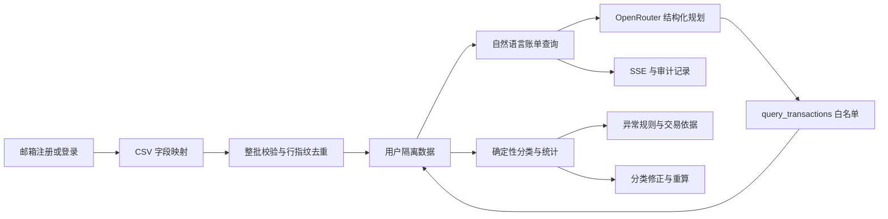

# 当前交付状态

> 版本：`0.3.0`　·　验证日期：2026-09-05　·　结论：本地代码检查通过，数据库迁移与容器门禁待验证

## 当前定位

当前版本完成 CSV 账单导入与受控账单查询闭环，用于验证字段映射、原子校验、账户内去重、用户隔离、模型规划、确定性计算和运行审计。最终产品定位为可审计、可复算的多账户财务分析 Agent；Excel、转账匹配、周期扣款、预算和报告尚未进入当前基线。

## 已交付能力

| 能力 | 当前结果 |
| --- | --- |
| 身份与隔离 | 邮箱注册、Argon2 密码哈希、HttpOnly Session；Run、卡片、交易和分类修正按用户隔离 |
| 卡片清单 | 使用稳定 UUID；仅展示名称、账户、脱敏尾号和状态 |
| 账单导入 | CSV 最大 10 MB、最多 5,000 行；字段映射、整批校验、账户复用、行级去重和持久化导入报告 |
| Agent 规划 | OpenRouter 输出通过 JSON Schema、Pydantic 和工具白名单 |
| Agent 工具 | 当前仅开放 `query_transactions`，支持自然语言日期范围 |
| 确定性分析 | 使用 Decimal 按币种和分类统计，模型不计算金额 |
| 异常识别 | 大额支出和短时重复扣款返回规则、阈值和交易 ID |
| 分类修正 | 修正独立持久化，不覆盖原始交易，并立即重算结果 |
| 运行治理 | Run、模型元数据和只追加审计事件持久化；SSE 支持续传去重 |
| Web | 深色主题、中英切换、脱敏卡片、分析结果、异常依据和运行记录 |

## 尚未交付

| 目标能力 | 当前差距 |
| --- | --- |
| 多来源归一化 | 尚无 Excel、银行模板、收支方向列、持久化映射和跨账户转账匹配 |
| 多工具 Agent | 尚无汇总、异常解释、周期扣款、预算、导入报告和审计查询工具 |
| 主动核查 | 尚无周期扣款识别、预算偏差和定时核查任务 |
| 本地确认操作 | 尚无 Agent 发起的提醒、预算和报告确认流程 |
| 月度核查报告 | 尚无稳定报告模型和脱敏导出 |

最终形态见 [最终产品界面](final-product.html)，后续顺序见 [产品路线图](ROADMAP.md)。该界面与周期扣款、预算导航空态描述目标能力，不作为当前版本的交付证据。

## 固定验收集

| 类别 | 覆盖用例 |
| --- | --- |
| 卡片 | 认证读取、脱敏字段、空态、跨用户隔离和未登录拒绝 |
| 导入 | CSV/分号分隔、字段映射、文件限制、整批拒绝、重复真实交易、重复导入和跨用户历史隔离 |
| 分类 | 常见商户、未知商户、用户修正、非法分类和跨用户访问 |
| 统计 | 多币种隔离、小数金额精确汇总 |
| 异常 | 大额支出、十分钟内相同扣款和交易证据 |
| 安全 | 商户伪指令仅作为数据处理，不进入 Agent 指令通道 |
| 事件 | `Last-Event-ID` 续传不重复；非法游标返回 400 |

## 验收证据

| 检查 | 结果 |
| --- | --- |
| API | Ruff、Mypy 通过；Pytest 39 个用例通过 |
| Web | ESLint、Vitest 6 个用例与 Vite 生产构建通过；覆盖保留页面的导航与空态 |
| 数据库 | 仓储自动测试通过；`20260904_0004` 包含账务日期与历史运行快照回填，更新后的完整迁移链仍需 PostgreSQL 验证 |
| CI | 已加入 PostgreSQL 迁移与 API/Web 容器构建门禁，尚未触发远端运行 |
| 导入联调 | 隔离环境真实 HTTP 验证注册、首次导入、重复去重与当前用户历史读取 |
| 真实浏览器 | 登录、中文深色界面、卡片空态、SSE 查询、图表、分类修正和 390px 布局已验证；本版导入页由组件测试覆盖 |
| OpenRouter | 真实规划请求成功，并记录 Provider、模型、请求 ID、延迟和 Token 用量 |

## 当前边界

系统不连接真实银行，不处理真实资金，不推导实时余额。当前 Agent 仅执行用户授权范围内的账单查询；真实转账、卡片状态变更、代扣关闭和理财交易不属于产品范围。
