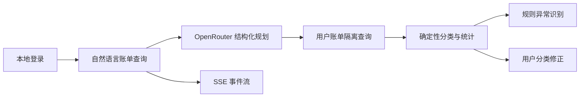

# 当前交付状态

> 版本：`0.2.0`　·　验收日期：2026-09-04　·　结论：通过

## 已交付能力

| 能力 | 当前结果 |
| --- | --- |
| 身份与隔离 | HttpOnly Session；用户只能读取自己的 Run、交易和修正记录 |
| Agent 规划 | OpenRouter 输出必须通过 JSON Schema、Pydantic 与工具白名单 |
| 账单查询 | 按自然语言日期范围查询本地银行数据 |
| 账单分析 | 使用 Decimal 按币种和分类汇总，不由模型计算金额 |
| 异常识别 | 大额支出和短时重复扣款返回规则、阈值与交易依据 |
| 分类修正 | 用户修正独立持久化，不覆盖原始交易，并立即重算统计 |
| 运行过程 | Run、模型元数据与只追加审计事件持久化；SSE 支持续传去重 |
| Web | 深色主题、中英切换、统计图表、异常提示、操作记录与低干扰状态动效 |

## 固定验收集

| 类别 | 覆盖用例 |
| --- | --- |
| 分类 | 常见商户、未知商户、用户修正、非法分类、跨用户访问 |
| 统计 | 多币种隔离、小数金额精确汇总 |
| 异常 | 大额支出、十分钟内相同扣款 |
| 安全 | 商户伪指令仅作数据处理，不进入 Agent 指令通道 |
| 事件 | `Last-Event-ID` 续传不重复；非法游标返回 400 |

## 验收证据

| 检查 | 结果 |
| --- | --- |
| API | Ruff、Mypy 通过；Pytest 27 个用例通过 |
| Web | ESLint、Vitest 3 个用例与 Vite 生产构建通过 |
| 数据库 | 本地迁移往返通过；远程 Compose 与 K3s 均为 `20260903_0002` |
| 真实浏览器 | 登录、中文深色界面、加载反馈、结果动效、SSE 查询、图表、分类修正和 390px 布局通过 |
| OpenRouter | 真实规划请求成功，记录 Provider、模型、请求 ID、延迟与 Token 用量 |
| 远程运行 | Compose 的 Web、API、PostgreSQL 健康；K3s 工作负载健康 |

远程用户入口由 Docker Compose 提供。K3s 集群未安装 Traefik，Web 保持集群内可达，不作为当前用户入口。

## 当前边界

系统不连接真实银行、不处理真实资金。卡片状态变更、订阅与代扣、转账、交易身份验证和审批尚未实现。
