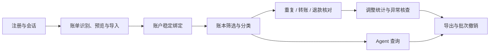
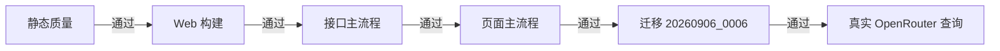
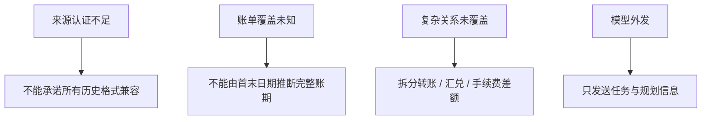

# 当前交付状态

> 本地主流程已经闭环。提交、CI、远端发布和发布后验收属于独立发布阶段；真实支付平台文件仍需脱敏样本认证。

## 已形成的闭环

身份、交易和运行记录均按用户隔离。导入支持 CSV 与 XLSX，具备来源识别、账户确认、整批校验、去重、排除报告和撤销重导。交易关系支持候选确认、人工配对、排除、撤销以及并发版本保护；调整统计按币种和发生日处理副本、双边转账、部分退款与跨期到账。

Agent 当前完成基础账本查询：OpenRouter 负责规划日期查询，分类、统计、异常规则与权限判断仍由程序执行。周期扣款和预算只显示未交付入口，不产生虚构数据。

## 验证状态

Ruff、Mypy、ESLint、TypeScript 与 Vite 构建已通过。注册登录、导入与拒绝、重复处理、分类、交易关系、核查、撤销重导和用户隔离已完成接口与页面验收；关系版本冲突、运行心跳续约和超时收敛也已验证。

CI 只负责静态检查、构建和隔离数据库迁移，不代表自动业务回归。仓库不保留测试样本或临时验收脚本。

## 尚存边界

系统不猜测小数分隔符，不补造时间；方向、状态或退款语义不明确时拒绝导入。关系调整不会改写原流水，账本与 Agent 的基础统计仍以原始交易为准。系统保存当前关系状态和 Agent 快照，不提供完整账本版本历史。

## 发布判断

代码可以进入提交阶段。发布后仍需核对数据库迁移、认证 Cookie、Web/API 健康状态和真实模型请求。真实来源兼容认证必须使用用户提供的脱敏导出文件，且不得包含密码。

[下一步计划](ROADMAP.md) · [运行与发布](RUNBOOK.md) · [系统设计](ARCHITECTURE.md)
