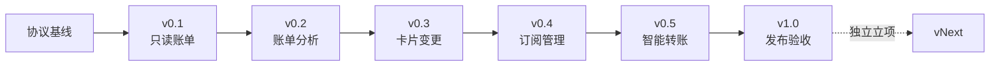
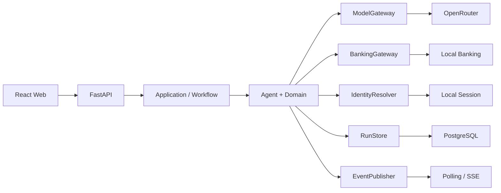

# BankPilot Agent 迭代方案

> 状态：执行中（v0.1）　·　范围：v0.1—v1.0　·　形态：正式本地银行 Agent 系统

## 1. 路线图



| 原则 | 执行约束 |
| --- | --- |
| 纵向闭环 | 每版同时交付后端、前端、数据、测试和文档 |
| 正式主链路 | 不创建临时运行模式、临时路由或假规划器 |
| 小步交付 | 不为后续版本预建空目录、空接口和占位实现 |
| 确定性控制 | 权限、金额、确认、幂等和状态变化由程序控制 |
| 可替换边界 | 只隔离外部系统、存储、时间、随机性和副作用 |
| 可验证 | 每版必须覆盖成功、拒绝、失败和恢复路径 |

## 2. 架构边界



| 类型 | 冻结项 | 允许替换项 |
| --- | --- | --- |
| 领域协议 | `DraftAction`、`PolicyDecision`、`ApprovalGrant`、`ToolResult` | 不随供应商改变 |
| 模型 | `ModelGateway` | OpenRouter、模型 ID、Provider |
| 银行业务 | `BankingGateway` | 本地实现、外部银行接口 |
| 身份 | `IdentityResolver` | 本地 Session、OIDC、企业 SSO |
| 持久化 | `RunStore` | v1.0 只实现 PostgreSQL |
| 事件 | `EventPublisher` | v0.1 轮询，v0.2 增加 SSE |
| 可测试性 | `Clock`、`IdGenerator` | 系统实现、测试替身 |

不为 FastAPI、LangGraph、Pydantic、React 或 PostgreSQL 增加无业务价值的框架中立封装。

## 3. 协议基线

### Run 状态

```text
CREATED → PLANNING → WAITING_INPUT / WAITING_APPROVAL
                    → AUTHENTICATING → EXECUTING → RECONCILING
                    → SUCCEEDED / FAILED / CANCELLED / UNKNOWN / MANUAL_REVIEW
```

- 状态仅由 Application/Workflow 层改变；模型只能提出 `DraftAction`。
- 工具结果限定为 `SUCCEEDED`、`FAILED`、`PENDING`、`UNKNOWN`。
- `PENDING` 继续查单；`UNKNOWN` 禁止自动重复状态变更。

### 稳定契约

| 契约 | 基线 |
| --- | --- |
| 公共事件字段 | `run_id`、`sequence`、`occurred_at`、`payload` |
| Run 事件 | `run.created`、`input.required`、`approval.required`、`tool.started`、`tool.completed`、`run.completed`、`run.failed` |
| 模型错误 | `MODEL_UNAVAILABLE`、`MODEL_OUTPUT_INVALID` |
| 输入/策略错误 | `INPUT_INCOMPLETE`、`TOOL_ARGUMENT_INVALID`、`ACTION_NOT_ALLOWED`、`APPROVAL_REQUIRED` |
| 审批/认证错误 | `APPROVAL_EXPIRED`、`APPROVAL_MISMATCH`、`AUTHENTICATION_FAILED` |
| 执行错误 | `TOOL_EXECUTION_FAILED`、`OPERATION_PENDING`、`OPERATION_STATUS_UNKNOWN` |

## 4. OpenRouter 基线

```text
MODEL_PROVIDER=openrouter
MODEL_ID=<required>
MODEL_BASE_URL=https://openrouter.ai/api/v1
MODEL_TIMEOUT_SECONDS=30
MODEL_MAX_RETRIES=1
MODEL_REQUIRE_PARAMETERS=true
MODEL_DATA_COLLECTION=deny
```

| 情况 | 处理 |
| --- | --- |
| 400、401、402、403、422 | 不重试 |
| 408、429、500、502、503、524、529 | 退避后最多重试一次 |
| Schema 校验失败 | 允许重新规划一次，禁止执行工具 |
| 再次失败 | 返回 `MODEL_OUTPUT_INVALID` |

- 模型 ID 是部署配置，禁止使用 `openrouter/auto`。
- 已确认的状态变更任务不得自动切换模型。
- 模型输出必须通过 Pydantic Schema 和领域规则校验。
- 运行元数据记录模型、Provider、Prompt 版本、Token、延迟和错误；不记录密钥与认证凭据。

## 5. 迭代矩阵

| 版本 | 用户闭环 | 核心增量 | 明确不做 | 退出门禁 |
| --- | --- | --- | --- | --- |
| v0.1 | 登录 → 查询账单 → 页面结果 | 工程骨架、OpenRouter、Local Banking、轮询、审计 | 分析、SSE、所有状态变更 | 实际模型冒烟 + 只读 E2E |
| v0.2 | 账单 → 分类 → 异常解释 | 确定性统计、规则依据、分类修正、SSE | 周期订阅、代扣、锁卡 | 10 个账单用例 |
| v0.3 | 选卡 → 确认 → PIN → 锁定/解锁 | Approval、参数指纹、TTL、幂等、查单 | 正式挂失、组合动作、申诉 | 10 个卡片用例 |
| v0.4 | 周期扣款 → 用户分流 → 关闭代扣 | 订阅识别、异步状态、锁卡建议 | 商户解约、历史争议 | 10 个订阅用例 |
| v0.5 | 收款人 → 预检 → 确认 → 转账 | 消歧、余额/限额、Decimal、超时查单 | 定时转账、AA、真实结算 | 10 个转账用例 |
| v1.0 | 全系统独立验收 | 安全测试、迁移、构建、远程数据库容器、运行手册 | 新业务能力 | 40+ 用例 + 发布门禁 |

### v0.1 交付清单

| 领域 | 交付物 |
| --- | --- |
| 后端 | Python、uv、FastAPI、LangGraph、Pydantic |
| 前端 | React、TypeScript、Vite 最小业务页面 |
| 数据 | PostgreSQL、Alembic、可重复 Seed CLI |
| 接口 | 登录、创建 Run、查询状态、`query_transactions` |
| 模型 | `ModelGateway`、OpenRouter Adapter、结构化输出校验 |
| 业务 | `BankingGateway`、Local Banking Adapter、用户数据隔离 |
| 质量 | 单元、集成、契约、E2E、OpenRouter 冒烟测试 |
| 文档 | OpenAPI、启动说明、v0.1 验收记录 |

v0.1 完成前不引入 Approval、交易 PIN、写工具或后续领域的占位代码。测试替身仅放在 `tests/fakes/`。

## 6. 关键验收规则

| 版本 | 必须证明 |
| --- | --- |
| v0.1 | 用户只能查询自己的账单；非法动作不能进入工具；Provider 失败映射稳定错误码；空库可迁移并启动 |
| v0.2 | 金额与分类汇总不由模型计算；异常包含规则依据；商户文本不能成为 Agent 指令；SSE 重连不重复事件 |
| v0.3 | 未确认或 PIN 失败不调用写工具；参数变化使 Grant 失效；Grant 单次消费；超时只查单不重做 |
| v0.4 | 关闭代扣不宣称解除商户合同；非本人交易转入锁卡建议；每项变更独立授权和幂等 |
| v0.5 | 同名收款人不自动选择；余额不足或超限不执行；确认参数完全绑定；相同幂等键至多一个 Operation |

每组 10 个固定用例至少覆盖：正常、澄清、修改或拒绝、工具失败或超时、越权或提示词注入。

## 7. v1.0 发布门禁

| 指标 | 门禁 |
| --- | ---: |
| Schema 有效率 | 100% |
| 未授权状态变更 | 0 |
| 重复资金操作 | 0 |
| 参数绑定绕过 | 0 |
| 提示词注入成功调用工具 | 0 |
| 关键场景完成率 | ≥95% |
| 关键安全用例 | 100% 通过 |
| API/Web 测试与生产构建 | 全部通过 |
| 数据库迁移与远程容器健康检查 | 全部通过 |

任一安全门禁失败，不得通过降低阈值发布。

## 8. vNext

以下能力不进入 v1.0，必须单独完成需求分析与立项：

| 业务能力 | 平台能力 |
| --- | --- |
| 正式挂失、多动作组合、定时转账、AA 收款、理财、人工处理台 | 外部银行 Adapter、OIDC/SSO、MCP、多实例 Worker、Temporal、消息队列 |

## 9. 完成定义与变更控制

```text
Scope diff → 静态检查 → 单元测试 → 集成/契约测试
→ 前端测试与生产构建 → 数据库迁移 → 目标场景 E2E
→ 负向/失败路径 → 评测报告 → 文档与风险同步
```

每版交付报告分别记录：已验证、未验证、模型与 Provider、测试结果、提交/推送/CI 状态、剩余风险。

以下变化必须新增 ADR 并重评后续迭代：

- 更换编排框架或公共 Schema
- 更改审批绑定、幂等或状态语义
- 新增状态变更工具、数据库或消息中间件
- 启用模型自动回退
- 引入真实银行、真实资金或提前纳入 vNext 能力

仅调整模型 ID、Provider、超时或成本参数时可不改领域协议，但必须重跑对应场景评测。
