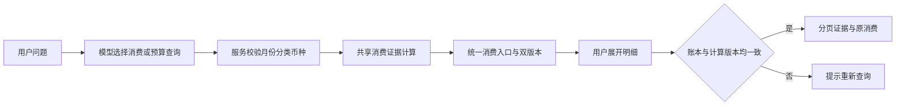

# R1 设计：消费追问与明细核对

设计日期：2026-09-17。文档状态：最终版。实施状态：已实现，本地验收与评审见 [R1 交付记录](R1_ACCEPTANCE.md)，尚未发布。

执行方式：由 Codex 负责实现、验证、问题修复和交付记录，按技术依赖和验收结果推进。

代码基线：`main@e03a88a`。本计划对应路线图 R1，后续阶段见 [迭代路线](ROADMAP.md)。

## 1. 目标

R1 提供消费构成与逐笔证据，支持用户核对“具体是哪几笔、为什么算出这个数”。消费与预算工具共用证据入口，任意自然语言流水搜索仍属于后续范围。

**本轮目标：用户在助手内完成“问一个月某类消费 → 查看构成 → 核对退款和原消费 → 必要时去账本修正 → 重新查询”的闭环。**

成功标准是金额可复核、页面上下文不丢失，且账本变更后不会把新明细挂在旧答案下面。保留已有预算修改能力，不增加写操作种类。

## 2. 优先级与依赖

| 方向 | 当前收益与代价 | 决定 |
| --- | --- | --- |
| 消费追问和明细 | 复用现有预算贡献证据，补齐已有助手的直接断点 | 本轮主线 |
| 对话持久化 | 能找回历史，但同时引入历史数据、删除、恢复与失效管理 | 后续独立迭代 |
| 自动周期识别 | 需要跨月样本、误报评估和用户反馈，当前真实样本认证不足 | 暂缓 |
| 更多助手写操作 | 会扩大冲突、审批和撤回矩阵 | 暂缓 |

真实账单认证、备份恢复和发布验收仍是上线前工作，不因新增功能而视作完成。本轮可使用合成数据完成开发；缺少真实样本时，只能声明规则验收通过。

## 3. 产品范围

### 必须交付

1. 新增单月、单支出分类、单币种的消费查询工具。不要求该分类已设置预算。
2. 服务端返回实际消费总额、消费额、退款冲减额、贡献条数和导入覆盖信息。
3. 消费查询和现有预算查询均提供同一消费证据入口；模型选择任一工具，都能查看对应分类/币种的确定性金额卡及分页明细。退款能展开原消费，明确两个日期与本月贡献。
4. 支持明确上下文的“具体哪些”“换成八月”。对象或币种不明确时澄清，不默认把多个币种合并。
5. 从证据打开对应账本流水，返回助手后保留对话和所选证据范围。
6. 账本修正、关系变化、撤销导入或计算规则升级后，旧证据请求明确失效；用户主动重新查询，形成新的答案。

### 明确不做

任意日期范围、账户筛选、商户模糊匹配、商户排名、自动分类、自动关系确认、自然语言创建固定支出、提醒、预测、预算结转及聊天历史存储。

“为什么这个月涨了”涉及跨月可比性和贡献归因，本轮不承诺自动解释。已有整月预算比较继续可用，但不能把差额推断成消费习惯变化。

### 交互示例（合成数据）

用户：“九月人民币餐饮花了多少？”

金额卡显示：**餐饮 · 2026 年 9 月 · CNY，实际支出 850.00**；下方为“消费 900.00 − 已确认退款 50.00 · 4 条贡献记录”。覆盖行显示“本币种已导入流水截至 9/16，账单完整性未确认”。

点击“查看构成”，列出三笔消费 500、250、150 和一笔退款 −50；退款发生于九月，原消费发生于八月。原消费仅作为解释证据，不再次计入九月。

用户修改分类后回到旧答案，显示“账本已更新，请重新查询”；不静默替换旧卡片的金额，也不展示新版本的分页结果。

## 4. 统计契约

- 复用预算现有口径：排除已确认重复副本及本人转账；已确认退款按到账月、原消费当前分类冲减。
- `net_spending = gross_spending - refund_offset`，全程 Decimal，HTTP 金额传字符串。负净支出是合法结果。
- `contribution_count` 是参与金额的证据条数，包含退款；不称为“购买次数”。覆盖数量是当月该币种全部已导入流水数，不与贡献条数混用。
- 无当月该币种流水：显示“尚无已导入数据”；有该币种流水但无该分类贡献：显示“已导入数据中该分类为 0”。均不证明现实支出为零。
- 未确认退款保留原有语义，不提前冲减；待确认关系不计入确定性结果。
- 从完整集合计算总额，明细分页只限制展示。继续执行现有月度 10,000 笔容量上限，超限明确失败，不返回截断合计。
- 页序固定为入账日降序、交易 ID 升序；每页 20 条，不做游标框架或数据库汇总缓存。

## 5. 技术方案

### 5.1 查询工具与接口

在 `domain/assistant.py` 新增严格的 `spending` 决策：参数仅有 `month`（月首）、`category`（支出分类枚举）、`currency`。身份只能来自认证会话，模型不能指定用户或 SQL。

工具职责：`spending` 查询一个消费范围及其构成，`budgets` 查询整月预算、超支和未设预算分类，`overview` 回答整月收支。`budgets` 为消费分类/币种提供同结构的 `spending_refs`，前端统一渲染“查看构成”。引用集合覆盖已设预算项与实际消费分类的并集，包括无预算消费、零支出预算项和负净支出。

统一消费结果包含：`scope`、`ledger_revision`、`calculation_version`、`calculated_at`、`gross_spending`、`refund_offset`、`net_spending`、`contribution_count`、`coverage`。`spending` 返回单项，`budgets.spending_refs` 返回多项；两者从同一个共享计算结果组装，不额外逐分类查库。消费引用不包含预算额度，不能用账本修订号证明预算额度仍有效；预算修改继续校验既有预算 ID 和版本。

新增只读 `GET /api/v1/assistant/spending-evidence`，参数为上述范围、`expected_revision`、`expected_calculation_version` 和 `page`。返回同范围合计、双版本、总条数及本页贡献证据。参数是查询条件，不是授权凭证；每次按当前用户重新校验和读取。页码为正整数，超过末页返回空明细和完整总条数，不改变合计。

汇总及明细请求分别在同一个可重复读事务内读取当前用户修订号与账务证据。账本修订号或计算版本任一不匹配，返回 `409 assistant_evidence_stale`，不返回新明细。翻页同样校验；用户修订号跨月份共享，其他月份变化也可能使证据失效，本轮接受这种保守行为。

`calculation_version` 由共享消费计算模块维护单一版本声明，覆盖自动分类、退款归属、关系排除、贡献定义和分页排序语义。相关规则变化必须同步更新版本并通过规则版本失效回归；API、预算和助手不得各自声明不同版本。它不是数据库迁移版本，也不是每次发布都变化的构建号。发布检查覆盖旧页面访问新规则及不同规则版本实例的请求，版本不一致只提示重新查询，不做旧规则回退。

不保存新快照或新表。旧答案只在当前页面内存中保留，刷新后仍清空。`ledger_revision` 用于拒绝混用版本，不代表能够重建历史。

### 5.2 共享消费计算

当前 `services/budgets.py::budget_workspace` 已构建完整 `BudgetEvidence`，包括退款原消费，但同时计算预算额度与覆盖。

将“读取月度事实并生成消费贡献、分类合计及来源覆盖”封装为共享用例，由预算工作区组装额度，由助手按分类和币种选择结果。数据库访问经过 `PlanningRepository`，调用方负责事务。

使用固定输入及独立计算的预期金额验证预算金额、容量拒绝和退款归类，单独验证分页排序。预算与助手之间的一致性检查作为补充，不代替独立金额断言。本轮不新增数据库表。

### 5.3 模型与展示分工

模型只接收范围、服务端汇总、贡献条数及覆盖信息，不接收完整流水、备注和账户名称。逐笔证据直接交给前端；“具体哪些”通过证据入口回答，不要求模型复述交易列表。

卡片金额与分解全部来自服务端，不从模型文本提取。模型文本仅作简短解释，不能替代确定性结果；真实模型验收检查文本是否与卡片矛盾，但不宣称能用提示词完全消除幻觉。

本轮沿用最多 6 次决策、90 秒总预算。没有必要为分页再次调用模型。模型超时、结构错误或容量拒绝均显示对应错误，保留输入，不回退成“无消费”。

历史消息仍用于理解追问，但新增可选的结构化消费上下文，包含当前选中消费范围，单独传入 `ChatInput`。单项结果可默认选中，多项预算结果须点击选定或澄清；上下文按月首、分类、币种严格校验，只作查询线索，不携带可信金额或授权。自然语言与选中范围冲突时遵从明确的新问题；“那几笔”只有一个明确范围时才能继承。不得仅从模型上一条回复文本中恢复范围。

前端“查看构成”直接绑定该次响应的结构化范围及双版本，无须模型再次猜测，也不消耗对话轮数。现有对话轮数上限保留明确提示，并提供主动新建对话入口；有待确认提案时先处理或取消，不隐式丢弃。修改预算继续走既有提案及点击确认路径。

### 5.4 前端与跳转

- 扩展 `features/assistant/types.ts` 和 `AssistantEvidence.tsx`，为消费证据提供金额卡与明细视图。
- 在助手现有侧栏内切换答案/明细视图；不叠加第二层模态侧栏。返回答案恢复滚动及当前页。
- 明细包括日期、商户、币种、对本月贡献、退款原消费展开入口；不把原始交易金额与消费贡献符号混为一谈。
- 复用工作区导航打开具体交易。若当前路由不能定位交易，仅补 `transactionId` 定位能力，并遵守既有总览、账本、规划期间隔离。
- 退款跳转定位退款流水，原消费有单独入口；不把“按分类过滤账本”伪装为完全相同的贡献集合。
- 跳转显式采用目标流水日期并解除会遮蔽该流水的账本筛选，保留返回前的账本上下文；交易不存在或已撤销时显示明确状态，不停留在看似正常的空列表。定位接口或读取路径继续检查当前用户归属。
- 已知本地账本写入后将相关答案标记“需要重新查询”；外部页面写入与服务端规则升级由明细接口双版本检查兜底。
- 请求按答案、范围和页码隔离；切换答案后的迟到请求不能覆盖当前结果。401 保留当前输入并提示重新登录；退出或用户切换清空证据。

## 6. 实施顺序

R1 作为一个完整迭代交付，由 Codex 完成共享计算、助手交互、验证和问题修复。

先建立合成夹具和独立金额预期，完成共享消费计算、双版本校验及分页接口；随后接入消费与预算两种工具入口、结构化上下文、金额卡、退款展开和流水定位；最后执行接口、模型与浏览器验收，形成交付记录。

共享计算须通过原预算金额及规则失效回归，再接入助手交互。发现退款或分类问题时先修正共同口径。导航改动限于流水定位和上下文恢复。全部验收门槛满足后，R1 才标记完成。

## 7. 验收矩阵

| 场景 | 必须观察到的结果 |
| --- | --- |
| 900 元消费、50 元跨月退款 | 合计 850；四条贡献之和等于合计；原消费不重复计入 |
| 重复副本、本人转账、未确认退款 | 仅已确认关系按规则生效，结果与预算工作区相同 |
| 无预算分类、无数据、零贡献、负净支出 | 四种情况都有准确结果与不同说明，不要求先创建预算 |
| 同分类 CNY 与 USD | 分币种查询；问题未明确且上下文有歧义时先澄清 |
| 多于 20 条、恰好及超过容量上限 | 分页不改变合计、不漏不重；超限无部分统计 |
| 查询后改分类、确认关系、撤销导入 | 旧明细/下一页返回失效；重新查询反映最新事实 |
| 账本不变，分类或贡献规则版本改变 | 旧引用返回 409；不得在旧卡片下展示新规则明细 |
| 固定决策先选 budgets，再追问具体哪些 | 首次已有消费入口；选中范围保留，明细金额与 spending 一致 |
| 多个分类/币种后追问、切换参考月份 | 未选对象时澄清；已选对象使用结构化范围，不依赖上一段回答措辞 |
| 额度单独修改 | 消费证据仍按账本和计算版本判断；预算提案另按预算 ID/版本校验 |
| 查询与写入并发 | 单个响应的金额、证据和修订号来自同一快照 |
| 用户 B 携带用户 A 的范围和修订号 | 只能查询 B 自己的数据；流水定位同样不能越权 |
| 迟到响应、切页失败、会话失效 | 不覆盖其他答案、不伪造空数据；可重试、保留输入 |
| 跳转跨月原消费再返回 | 交易定位正确，助手上下文保留，总览期间不变 |
| 带分类/账户/批次筛选时跳转，以及目标被撤销 | 无无声遮蔽；返回恢复上下文，已撤销明确提示 |
| 真实模型问法及追问 | 至少 20 个固定场景：直接查询、月份追问、歧义、能力外请求；记录逐例结果与失败原因 |
| 修改预算原路径 | 新只读工具不创建提案；明确修改才提案，确认仍幂等且不覆盖过期版本 |

账务、隔离、失效和确认边界属于硬门槛，任一失败不可交付。真实模型 20 个场景的目标是至少 18 个完成预期交互，且不得出现越权写入、跨币种合计或把未执行提案说成已执行；这个样本只证明本轮场景，不代表普遍准确率。

在 `scripts/acceptance/` 下交付合成数据、断言脚本和运行说明，并新增 `make verify-business` 入口。使用现有运行环境执行脚本，验证跨月退款、重复/转账排除、负净支出、用户隔离、双版本失效、工具选择两条路径和明确版本冲突。固定模型决策用于确定性路径回归，真实模型场景另行执行与记录。

验收在专用隔离 PostgreSQL 中运行，脚本创建并清理自己拥有的样本，拒绝业务库目标；连续运行两次不得依赖残留数据。提交内容只包含合成数据，不包含真实账单、凭据或模型密钥。缺少数据库或模型配置分别标记未执行，不能以跳过作为通过。

执行 `make verify`、`make verify-business` 与 `git diff --check`；金额和竞争场景需接口级验证，不能用静态检查代替。验收记录包含代码/计算版本、命令、输入、预期、实际、失败原因及覆盖边界。共享算法修改必须重跑业务回归；CI 在独立库接入确定性回归，真实模型验收单列，不用离线模拟替代。

上线验收包括真实脱敏账单、生产代理下助手超时与错误提示，以及前后端同批发布。

## 8. 完成定义

用户能从消费或预算回答走到逐笔构成，识别跨月退款，修正后重新查询；同一账本及计算版本下助手卡片、证据合计和预算消费值一致。固定回归可以在干净隔离库重复运行，规则升级不会混用旧证据。文档准确说明提交、验证和发布状态。此后按路线图依赖推进后续迭代。
