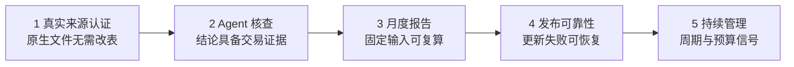
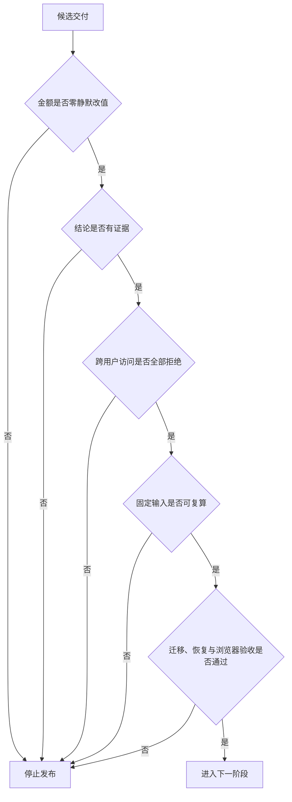

# 产品路线图

下一阶段不以页面数量为目标，而是让“真实账单 → 关系核对 → Agent 解释 → 可复算报告”成为可靠的长期使用闭环。

## 交付主线

真实来源认证先核对实际导出入口、字段、数量、日期、金额和状态，至少完成两个来源。Agent 随后接入数据覆盖范围、交易关系和调整统计，证据不足时必须停止结论。月度报告保存数据版本、规则版本和未决问题，新数据生成新结果而不覆盖旧结果。

发布可靠性覆盖迁移、隔离、备份恢复、数据删除、分页和真实浏览器验收。只有交易覆盖足够可信后，周期扣款与预算才进入实现，并且所有信号都必须可解释、可确认、可关闭。

## 进入下一阶段的条件

去重还必须同时满足两个方向：重复导入不能新增交易，不同的真实交易不能被合并。效果评估使用同一份数据对比人工核对，关注耗时、确认次数和错误数量，而不是模型生成文本的流畅度。

## 稳定边界

来源适配器只解释文件结构；标准交易保存不可静默覆盖的流水；交易关系描述重复、转账和退款；核查记录保存用户判断；Agent 只选择步骤。新能力必须沿用这些边界，不提前创建没有业务闭环的服务或数据模型。

真实转账、收款、银行卡状态变更、关闭代扣、理财交易、非公开银行接口和实时余额不进入产品范围。系统也不代表银行确认争议或退款。

[当前交付状态](CURRENT_STATE.md) · [系统架构](ARCHITECTURE.md)
