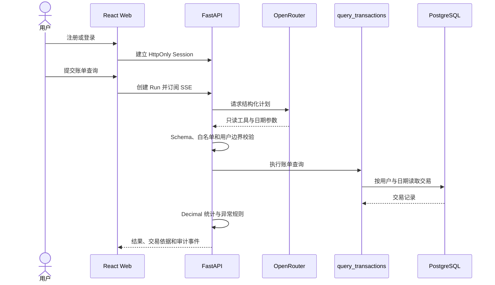
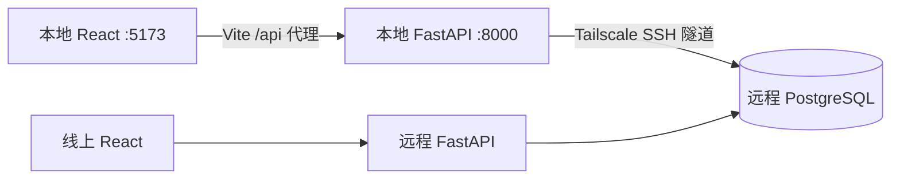

# 运行手册

## 当前运行链路



当前 Agent 只开放 `query_transactions`。账单导入已作为独立的确定性数据入口接入；导入报告查询、周期扣款、预算、报告和确认工具尚未进入 Agent 运行链路，详见 [当前交付状态](CURRENT_STATE.md)。

账单导入是独立的确定性数据入口，不经过模型。支持 UTF-8 CSV（逗号、分号或制表符）、自动字段识别、单账户币种、最多 10 MB/5,000 行；金额列必须使用正负号表达收支方向。可从明确的账户、币种列填充归属；不存在时由用户确认。交易编号用于账户内稳定去重，相同编号内容冲突时拒绝写入；缺少编号时使用内容指纹，不能保证跨来源去重。任一失败行都会拒绝整批交易写入；预览不保存批次，正式提交的解析失败保留拒绝报告，编号冲突返回 409。

支付宝、微信由独立来源配置解释方向、状态、金额和编号。CSV 支持 UTF-8 与 GB18030；XLSX 支持未加密单工作表，拒绝公式及可能丢失精度的长数字编号。原生结构时间按 UTC+8 解释；标准字段带时间的值必须有时区。来源账户由用户确认，同一来源账户应使用相同名称，来源前缀由服务端添加。明确失败或不计收支的记录进入逐行排除报告；未知状态、歧义退款或方向拒绝整批，不推导净消费。压缩包先在本地解密，系统不接收支付密码，不支持 PDF、XLS。

字段结构参考公开项目 [alipay-wechat-merge](https://github.com/yann0917/alipay-wechat-merge) 与 [personal-web](https://github.com/antareserQi/personal-web)，不是平台稳定接口契约。支付宝识别交易订单号/交易时间/商品说明或交易号/交易创建时间/商品名称两种字段组合；微信识别交易单号/交易时间/当前状态。其他结构拒绝或要求明确标准字段。真实脱敏导出样本尚未验收，不宣称全部原生账单兼容。业务验收通过页面与接口执行，使用独立验收账户并清理数据；仓库不保留测试文件。

## 运行拓扑



本地前后端运行当前工作区代码，与线上共用远程数据库。手动操作会影响同一份业务数据；CI 使用专用 PostgreSQL 验证迁移；业务验收不得修改已有用户数据。

## 本地开发

首次复制配置模板，填写数据库凭据、独立 Session Secret、模型 ID 与 OpenRouter Key：

```bash
cp .env.example .env
make install
```

数据库保持远程主机回环绑定，通过 Tailscale 地址建立 SSH 隧道（替换主机、用户和密钥路径）：

```bash
ssh -N -L 127.0.0.1:55433:127.0.0.1:55433 \
  -o ExitOnForwardFailure=yes -o ServerAliveInterval=30 \
  -i <ssh-key> <user>@<tailscale-host>
```

分别在两个终端启动：

```bash
make api
```

```bash
make web
```

打开 http://127.0.0.1:5173 。前端将 `/api` 代理到本地 8000 端口，前后端修改均自动重载。`make api` 先执行 `alembic upgrade head`，失败则不会启动；模型结构一致性可用 `cd api && uv run alembic check` 检查。迁移文件修改后需重新运行迁移，热重载不会执行迁移。

运行任务每十五秒更新心跳，超过两分钟未更新才标记为 UNKNOWN；定期扫描与启动扫描使用同一规则，并锁定任务避免并发终态覆盖。所有共享库的 API 实例必须使用同一恢复协议；旧版本服务尚未更新时，仍不得在其他实例执行任务期间重启旧服务。

数据库结构变更必须通过迁移记录落实，禁止手工改表造成模型漂移；涉及删除字段或数据时先备份、确认兼容性，再执行。不要运行 seed 向共享库注入测试数据。

`.env` 被 Git 忽略，权限应设为 600；具体地址、密码、Session Secret 和 OpenRouter Key 不提交到仓库。

## 必需配置

| 环境 | 配置来源 | 是否提交 |
| --- | --- | --- |
| 本地开发 | 根目录 `.env`：本地代理、数据库隧道与服务端密钥 | 不提交 |
| CI 验证 | `.github/workflows/ci.yml`：临时 PostgreSQL 与静态检查配置 | 提交，不含真实凭据 |
| 线上部署 | `deploy/compose.yaml` + GitHub Environment + 远程 `deploy/.env` | 只提交编排与无密钥模板 |

`.env.example` 只说明配置字段，不是运行环境。CI 发布包仅包含当前 Git 提交的文件；生产 Web 构建不读取本地开发代理配置，远程部署保留服务器自己的 `deploy/.env`。

| 配置 | 要求 |
| --- | --- |
| `OPENROUTER_API_KEY` | 只配置在 API 运行环境，不得进入 Web、代码、日志或镜像 |
| `MODEL_ID` | 必须支持 `response_format=json_schema`，禁止使用自动模型 |
| `BANKPILOT_SESSION_SECRET` | 至少 32 位随机值 |
| `BANKPILOT_API_ORIGIN` | 本地 React 的 API 代理目标，默认 `http://127.0.0.1:8000` |
| `BANKPILOT_DATABASE_URL` | 本地 API 指向 SSH 隧道；远程 API 指向 Compose 内部 PostgreSQL |
| `PUBLIC_WEB_ORIGIN` | 远程页面的 Tailscale Origin；Compose 会追加本地 React Origin |
| `WEB_BIND_IP` | 远程主机的 Tailscale 地址，禁止使用 `0.0.0.0` |

OpenRouter 请求启用 `require_parameters=true` 与 `data_collection=deny`。模型只接收用户任务和规划所需上下文；原始交易由本地工具读取。模型输出必须通过 Schema、工具白名单和领域规则校验。

远程 API 使用 `BANKPILOT_ENV=production`。当前若通过 Tailscale 私网 HTTP 访问，必须显式设置 `BANKPILOT_SESSION_COOKIE_SECURE=false`，否则浏览器不会保存注册或登录后的 Session Cookie；切换到 Tailscale HTTPS 后应改为 `true`。数据库端口仅绑定远程回环地址，本地通过 SSH 隧道访问，不直接向 Tailscale 或公网暴露。

## 当前 API

| 方法 | 路径 | 用途 |
| --- | --- | --- |
| `GET` | `/api/v1/healthz` | 进程存活 |
| `GET` | `/api/v1/readyz` | 数据库就绪 |
| `POST` | `/api/v1/auth/register` | 注册用户并创建 HttpOnly Session |
| `POST` | `/api/v1/auth/login` | 创建 HttpOnly Session |
| `GET` | `/api/v1/auth/me` | 获取当前用户 |
| `POST` | `/api/v1/auth/logout` | 销毁 Session |
| `GET` | `/api/v1/cards` | 获取当前用户的脱敏卡片清单 |
| `GET` | `/api/v1/imports` | 获取当前用户的账单导入历史 |
| `POST` | `/api/v1/imports/decode` | 认证后解码 base64 CSV/XLSX，返回供识别与预览的文本 |
| `POST` | `/api/v1/imports` | 校验、去重并原子导入已解码账单 |
| `POST` | `/api/v1/imports/detect` | 识别字段、显式账户和币种 |
| `POST` | `/api/v1/imports/preview` | 预览交易、错误行和重复数量 |
| `POST` | `/api/v1/imports/{batch_id}/revoke` | 撤销批次实际写入的交易 |
| `GET` | `/api/v1/accounts` | 获取当前用户账本账户 |
| `GET` | `/api/v1/transactions` | 按日期读取交易账本 |
| `POST` | `/api/v1/transactions/{transaction_id}/category` | 独立修正交易分类 |
| `POST` | `/api/v1/runs` | 创建账单查询 Run |
| `GET` | `/api/v1/runs/{run_id}` | 查询运行结果 |
| `GET` | `/api/v1/runs/{run_id}/events` | 订阅并续传 SSE 事件 |
| `POST` | `/api/v1/runs/{run_id}/transactions/{transaction_id}/category` | 保存分类与事件，结果快照不变，新查询读取修正 |
| `GET` | `/api/v1/run-history` | 当前用户最近 50 次运行 |
| `GET` | `/api/v1/reviews` | 指定期间的确定性异常与已保存判断 |
| `POST` | `/api/v1/reviews` | 重算证据后保存正常、待核实或待处理状态及备注 |

路线图中的工具名称不是当前 API，不得作为已实现接口调用。

## 验证

数据库需迁移至 `20260905_0005` 后再启动对应 API。迁移增加时间精度和核查结论；已有交易精度为未知，不触发分钟级重复规则。部署前在隔离 PostgreSQL 验证完整迁移与恢复，不直接用业务库做迁移测试。

统计为流入/流出，不是净消费；日期或未知精度不作为分钟级依据。账本提供筛选结果 CSV 导出，核查表保留最新判断而非历次变更。核查判断不更改金额，撤销批次后旧证据不可继续提交。运行结果保持快照，账本修改后重新查询。

```bash
make verify
```

仓库不含自动化测试和测试样本。静态检查与构建不能代替功能验收；发布验收需执行页面、接口与真实 OpenRouter 请求，分别记录模型、数据库、浏览器和远程运行结果。

心跳超时的 Run 被标记为 `UNKNOWN`，不会自动重做工具调用。仓库仅保留自动发布机制与通用容器编排；具体域名、主机、账号和凭据由 GitHub Environment 与远程环境管理。
