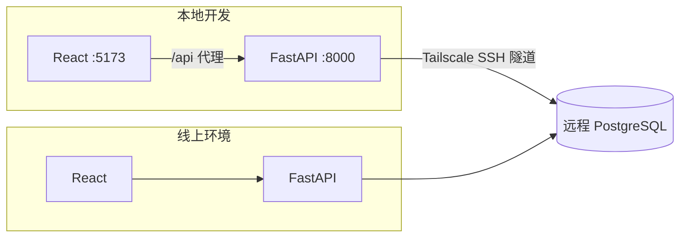
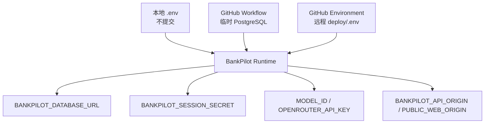
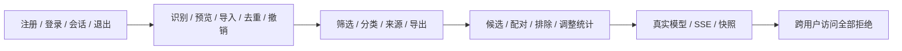
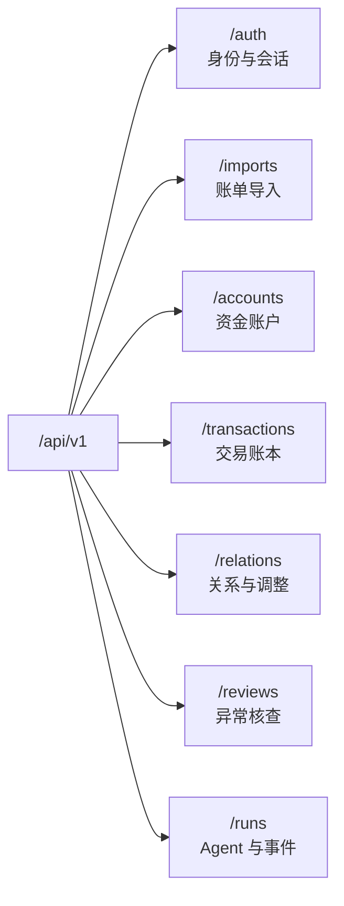

# 运行手册

> 本地与线上使用同一套业务数据库。开发、迁移或验收操作会影响共享数据；不要执行 seed，也不要使用现有用户测试。

## 运行拓扑



数据库端口只绑定远程回环地址。本地通过 SSH 隧道访问，线上 API 通过容器内部网络访问。

## 本地启动

首次准备：

```bash
cp .env.example .env
chmod 600 .env
make install
```

`.env` 仅用于本地且不提交。填写数据库连接、独立 Session Secret、模型 ID 和 OpenRouter Key，不要把真实值写入命令、日志或文档。

建立并保持数据库隧道：

```bash
ssh -N -L 127.0.0.1:55433:127.0.0.1:55433 \
  -o ExitOnForwardFailure=yes \
  -o ServerAliveInterval=30 \
  -i <ssh-key> <user>@<tailscale-host>
```

分别启动 API 与 Web：

```bash
make api
```

```bash
make web
```

页面位于 [http://127.0.0.1:5173](http://127.0.0.1:5173)，API 存活检查为 `http://127.0.0.1:8000/api/v1/healthz`，数据库就绪检查为 `http://127.0.0.1:8000/api/v1/readyz`。

## 配置边界



Session Secret 至少 32 位，OpenRouter Key 只进入 API 环境。`WEB_BIND_IP` 必须使用远程主机的 Tailscale 地址，禁止绑定 `0.0.0.0`。私网 HTTP 使用 `BANKPILOT_SESSION_COOKIE_SECURE=false`，切换 Tailscale HTTPS 后改为 `true`。

## 迁移与质量检查

`make api` 会先执行数据库升级。模型变化后可单独运行：

```bash
cd api
uv run alembic upgrade head
uv run alembic check
```

当前代码要求数据库版本 `20260906_0006`。迁移必须先在独立 PostgreSQL 验证升降级与结构一致性，禁止手工改表。

静态质量与 Web 构建：

```bash
make verify
```

## 业务验收



`make verify` 不包含上述业务回归。临时账户、数据和文件应在验收后删除，不得写入仓库。数据库连接失败时先检查 Tailscale、SSH 进程和远程数据库，不要把重启或清理服务作为第一步。

## API 面



模型调用固定使用支持 JSON Schema 的明确模型，并启用 `require_parameters=true` 与 `data_collection=deny`。运行每 15 秒续约，超过 2 分钟未更新会收敛为 `UNKNOWN`，不会自动重做工具调用；多 API 实例必须使用相同恢复协议和数据库版本。

## 发布

CI 负责静态检查、Web 构建和隔离数据库迁移检查。发布包只包含当前 Git 提交，远程环境保留自己的 `deploy/.env`。发布完成后依次确认 API/Web 版本、数据库迁移、Cookie 策略、健康检查、页面登录和真实 Agent 请求。

主机、域名、账号和凭据只保存在 GitHub Environment 与远程环境。

[系统架构](ARCHITECTURE.md) · [交付状态](CURRENT_STATE.md)
