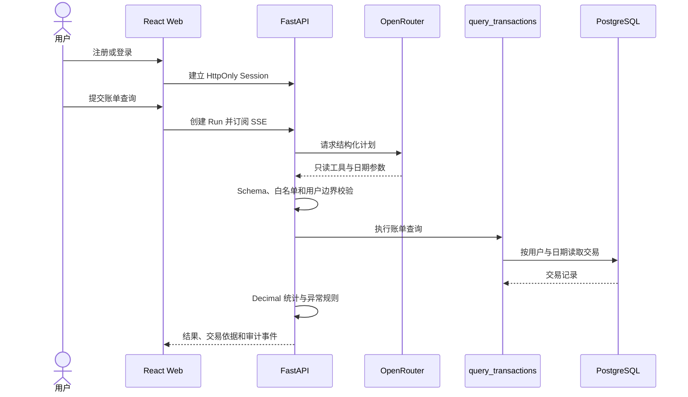
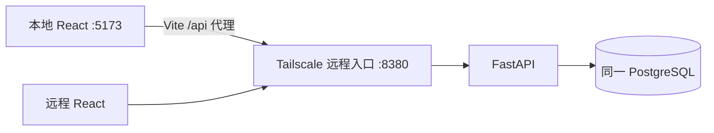

# 运行手册

## 当前运行链路



当前 Agent 只开放 `query_transactions`。账单导入已作为独立的确定性数据入口接入；导入报告查询、周期扣款、预算、报告和确认工具尚未进入 Agent 运行链路，详见 [当前交付状态](CURRENT_STATE.md)。

账单导入是独立的确定性数据入口，不经过模型。当前支持 UTF-8 CSV、显式字段映射、单账户币种、最多 10 MB/5,000 行；金额列必须使用正负号表达收支方向。任一失败行都会拒绝整批交易写入，但保留可查询的批次报告。

## 运行拓扑



远程主机是唯一 API 与业务数据库运行位置。本地开发和远程页面均通过 Tailscale 访问同一服务，使用同一用户、Session 数据和业务数据；本地不启动 API 或数据库。自动测试仍使用临时 SQLite 或 CI 专用 PostgreSQL，不得连接远程业务数据库。

## 本地 React 开发

首次配置仓库根目录的本地环境文件：

```bash
cp .env.example .env
```

将 `BANKPILOT_REMOTE_ORIGIN` 改为远程主机的 Tailscale HTTP(S) Origin，例如 `http://<tailscale-ip>:8380`，然后启动 Web：

```bash
cd web
npm install
npm run dev
```

打开 `http://127.0.0.1:5173`。注册、登录、账单导入与 Agent 请求会由 Vite 代理到远程 Tailscale 入口；修改数据会立即影响远程页面看到的同一份数据。

`.env` 被 Git 忽略，不得把 Tailscale 具体地址、密码、Session Secret 或 OpenRouter API Key 提交到仓库。

## 必需配置

| 配置 | 要求 |
| --- | --- |
| `OPENROUTER_API_KEY` | 只配置在 API 运行环境，不得进入 Web、代码、日志或镜像 |
| `MODEL_ID` | 必须支持 `response_format=json_schema`，禁止使用自动模型 |
| `BANKPILOT_SESSION_SECRET` | 至少 32 位随机值 |
| `BANKPILOT_REMOTE_ORIGIN` | 本地 React 使用的远程 Tailscale Web/API Origin，不含路径 |
| `BANKPILOT_DATABASE_URL` | 远程 API 指向 Compose 内部 PostgreSQL 地址 |
| `PUBLIC_WEB_ORIGIN` | 远程页面的 Tailscale Origin；Compose 会追加本地 React Origin |
| `WEB_BIND_IP` | 远程主机的 Tailscale 地址，禁止使用 `0.0.0.0` |

OpenRouter 请求启用 `require_parameters=true` 与 `data_collection=deny`。模型只接收用户任务和规划所需上下文；原始交易由本地工具读取。模型输出必须通过 Schema、工具白名单和领域规则校验。

远程 API 使用 `BANKPILOT_ENV=production`。当前若通过 Tailscale 私网 HTTP 访问，必须显式设置 `BANKPILOT_SESSION_COOKIE_SECURE=false`，否则浏览器不会保存注册或登录后的 Session Cookie；切换到 Tailscale HTTPS 后应改为 `true`。数据库只由远程 Compose 内的 API 使用，不向 Tailscale 或公网发布端口。

## 当前 API

| 方法 | 路径 | 用途 |
| --- | --- | --- |
| `GET` | `/api/v1/healthz` | 进程存活 |
| `GET` | `/api/v1/readyz` | 数据库就绪 |
| `POST` | `/api/v1/auth/register` | 注册用户并创建 HttpOnly Session |
| `POST` | `/api/v1/auth/login` | 创建 HttpOnly Session |
| `GET` | `/api/v1/auth/me` | 获取当前用户 |
| `POST` | `/api/v1/auth/logout` | 销毁 Session |
| `GET` | `/api/v1/cards` | 获取当前用户的脱敏卡片清单 |
| `GET` | `/api/v1/imports` | 获取当前用户的账单导入历史 |
| `POST` | `/api/v1/imports` | 校验、去重并原子导入 CSV 账单 |
| `POST` | `/api/v1/runs` | 创建账单查询 Run |
| `GET` | `/api/v1/runs/{run_id}` | 查询运行结果 |
| `GET` | `/api/v1/runs/{run_id}/events` | 订阅并续传 SSE 事件 |
| `POST` | `/api/v1/runs/{run_id}/transactions/{transaction_id}/category` | 修正交易分类并重算分析 |

路线图中的工具名称不是当前 API，不得作为已实现接口调用。

## 验证

```bash
make verify
```

API 自动测试使用隔离数据库和模型替身，不调用外部模型。发布验收必须另行执行真实 OpenRouter 请求，并分别记录模型、数据库、浏览器和远程运行结果。

服务重启会将未到终态的 Run 标记为 `UNKNOWN`，不会自动重做工具调用。仓库仅保留自动发布机制与通用容器编排；具体域名、主机、账号和凭据由 GitHub Environment 与远程环境管理。
