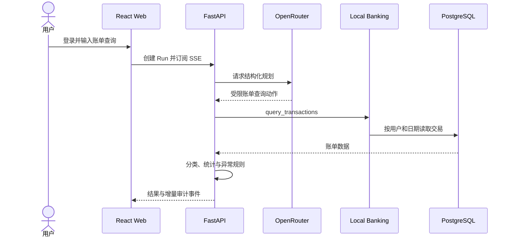

# 运行手册

## 系统路径



## 本地开发

```bash
cp .env.example .env
cd api
uv sync --all-groups
uv run alembic upgrade head
uv run bankpilot seed
uv run uvicorn bankpilot.api.app:create_app --factory --reload --port 8000
```

另一个终端启动 Web：

```bash
cd web
npm install
npm run dev
```

打开 `http://localhost:5173`。Seed 命令交互读取邮箱和至少 12 位密码；数据库使用远程 PostgreSQL，不在本机启动数据库容器。

## 必需配置

| 配置 | 要求 |
| --- | --- |
| `OPENROUTER_API_KEY` | 只配置在 API 运行环境，不得进入 Web、代码或镜像 |
| `MODEL_ID` | 必须支持 `response_format=json_schema`，禁止使用自动模型 |
| `BANKPILOT_SESSION_SECRET` | 至少 32 位随机值 |
| `BANKPILOT_DATABASE_URL` | 指向 PostgreSQL；容器部署使用内部网络地址 |

OpenRouter 请求启用 `require_parameters=true` 与 `data_collection=deny`。模型输出必须通过本地 Schema 和领域规则校验。

## API

| 方法 | 路径 | 用途 |
| --- | --- | --- |
| `GET` | `/api/v1/healthz` | 进程存活 |
| `GET` | `/api/v1/readyz` | 数据库就绪 |
| `POST` | `/api/v1/auth/login` | 创建 HttpOnly Session |
| `GET` | `/api/v1/auth/me` | 获取当前用户 |
| `POST` | `/api/v1/auth/logout` | 销毁 Session |
| `POST` | `/api/v1/runs` | 创建账单查询 Run |
| `GET` | `/api/v1/runs/{run_id}` | 查询运行结果 |
| `GET` | `/api/v1/runs/{run_id}/events` | 订阅并续传 SSE 事件 |
| `POST` | `/api/v1/runs/{run_id}/transactions/{transaction_id}/category` | 修正交易分类并重算分析 |

## 验证与部署

```bash
make verify
```

API 自动测试使用隔离数据库和模型替身，不调用外部模型。发布验收必须另行执行真实 OpenRouter 请求。远程部署、数据库访问和安全边界见 [部署说明](../deploy/README.md)。

服务重启会将未到终态的 Run 标记为 `UNKNOWN`，不会自动重做工具调用。
