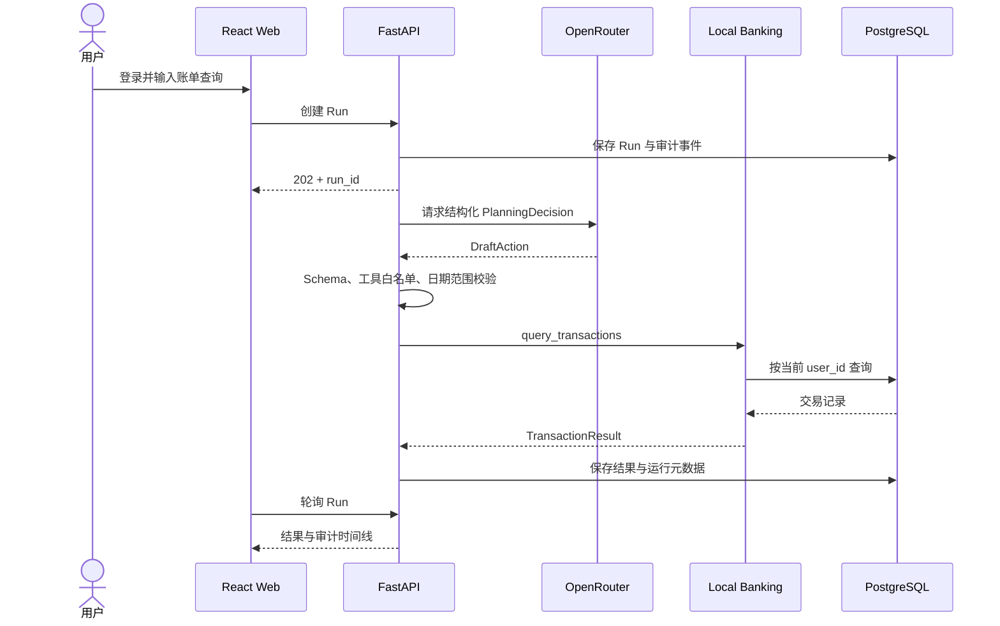

# v0.1 运行手册

> 目标：完成“登录 → 自然语言账单查询 → OpenRouter 规划 → 本地银行查询 → 页面结果与审计”的正式闭环。

## 系统路径



## 远程部署

生产形态下，Web、API 与 PostgreSQL 均在远程主机运行。Compose 默认只将 Web 和 PostgreSQL 绑定到回环地址，通过 SSH 隧道访问；K3s 由 Ingress 提供 Web 入口，PostgreSQL 仍仅在集群内可见。部署步骤和安全边界见 [远程部署说明](../deploy/README.md)。

## 本地开发

```bash
cp .env.example .env
cd api
uv sync --all-groups
uv run alembic upgrade head
uv run bankpilot seed
uv run uvicorn bankpilot.api.app:create_app --factory --reload --port 8000
```

在另一个终端启动前端：

```bash
cd web
npm install
npm run dev
```

打开 `http://localhost:5173`。Seed 命令会要求输入本地账户邮箱和至少 12 位密码，不提供固定账户。数据库仍使用远程 PostgreSQL，不在本机启动中间件容器。

## 必需配置

| 配置 | 要求 |
| --- | --- |
| `OPENROUTER_API_KEY` | 只配置在 API 服务 `.env`，不得进入 Web |
| `MODEL_ID` | 必须支持 `response_format=json_schema` |
| `BANKPILOT_SESSION_SECRET` | 至少 32 位随机值，生产环境必须替换 |
| `BANKPILOT_DATABASE_URL` | 本地开发指向远程 PostgreSQL；容器部署由 Compose 注入内部地址 |

OpenRouter 请求启用 `require_parameters=true` 与 `data_collection=deny`。模型输出仍须经过本地 Pydantic 和业务规则校验。

## API

| 方法 | 路径 | 用途 |
| --- | --- | --- |
| `GET` | `/api/v1/healthz` | 进程存活 |
| `GET` | `/api/v1/readyz` | 数据库就绪 |
| `POST` | `/api/v1/auth/login` | 创建 HttpOnly Session |
| `GET` | `/api/v1/auth/me` | 获取当前用户 |
| `POST` | `/api/v1/auth/logout` | 销毁 Session |
| `POST` | `/api/v1/runs` | 创建账单查询 Run |
| `GET` | `/api/v1/runs/{run_id}` | 轮询结果与审计事件 |

交互式 OpenAPI：`http://localhost:8000/docs`。

## 验证

```bash
make verify
```

API 测试使用测试替身和隔离数据库，不调用外部模型；OpenRouter 实际冒烟测试需要有效密钥，不能由普通单元测试替代。

## v0.1 边界

| 已交付 | 未进入本版 |
| --- | --- |
| 本地登录、用户隔离、只读账单、Run 轮询、审计、结构化模型输出 | 账单分析、SSE、审批、交易 PIN、卡片、代扣、转账 |

Run 在进程退出时可能中断；服务重启会将未到终态的 Run 标记为 `UNKNOWN`，不会自动重做工具调用。
